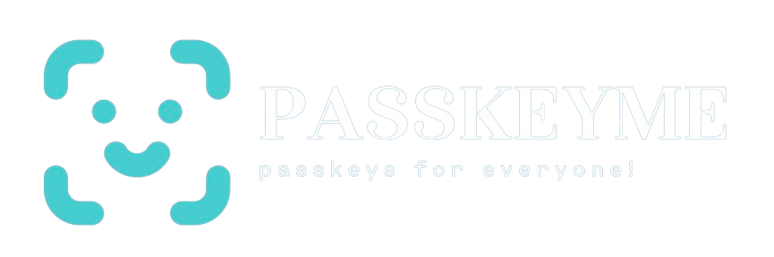

## What is Passkeyme?

Passkeyme is a SaaS platform that allows developers to easily integrate passkeys into their web or mobile applications. It provides a secure and user-friendly authentication alternative to traditional passwords.

### Why Use Passkeyme?

- **Enhanced Security:** Passkeys leverage public-key cryptography, reducing the risk of phishing, credential stuffing, and other common attacks.
- **User-Friendly:** Users no longer need to remember passwords, offering a better user experience.
- **Easy Integration:** Passkeyme can be integrated into existing authentication frameworks, complementing traditional authentication methods.

### Getting Started

To get started with Passkeyme, check out our [documentation](/docs).

