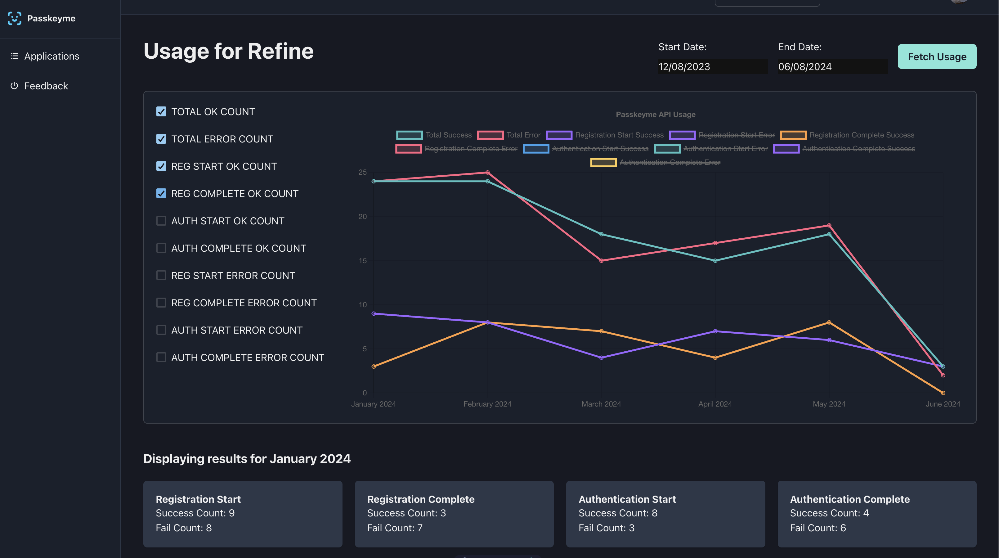

## Usage Charts added!

Passkeyme now includes usage reports - check out the Usage button from the Applications list/show pages!

Charts are interactive, so you can select date ranges, and view usage at monthly points.

Once you have built up a few months of usage, these will prove to be useful - but don't worry if there's nothig in there when you're just getting set up! 

