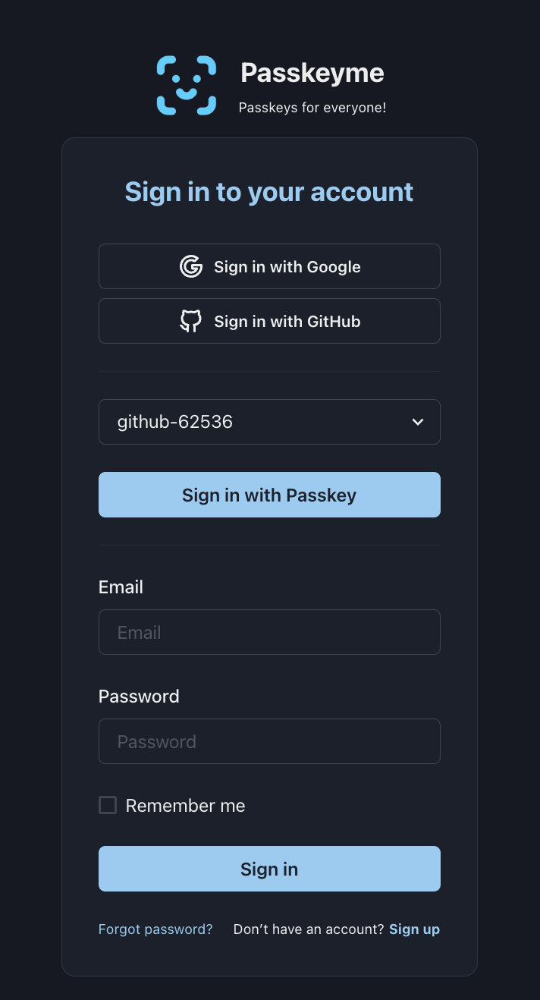

## Passkeyme.com supports Passkeys!

Well, it would be rude not to - you can now register a passkey for Passkeyme.com!



I do have to take a bow - it was pretty straightforward to set up. The basic flow is as follows:

1. User logs in as Normal
2. Go to the Upper RHS Passkey menu item
3. Follows the prompts to register their passkey
4. Log out
5. Select their username from the dropdown on the login screen
6. Click Sign in with Passkey
7. Done!

### Implementation

To implement, I went through the following steps:

1. Install the passkeyme-web-sdk via
```
npm install passkeyme-web-sdk
```


2. Then added a RegisterPasskey component to my React frontend:
```
import PasskeymeSDK from 'passkeyme-web-sdk';
const passkeymeSDK = new PasskeymeSDK();

...

      let challengeResponse = await axiosClient.post(`/api/auth/register-passkey`, {
        username: thisuser.username,
        displayname: thisuser.name
      });

      const passkeyResponse = await passkeymeSDK.passkeyRegister(challengeResponse.data.challenge);

      let completeResponse = await axiosClient.post(`/api/auth/register-passkey/complete`, {
        username: thisuser.username,
        credential: passkeyResponse.credential
      });
```

3. In the above, I added two new endpoints to my backend:
```
/auth/register-passkey
/auth/register-passkey/complete
```

These delegate to the passkeyme.com/webauthn/:appid/start_registration and complete_registration endpoints

4. For Authentication, I added the following two endpoints to my backend:
```
/auth/authenticate-passkey
/auth/authenticate-passkey/complete
```

Which similarly delegate to the passkeyme.com/webauthn/:appid/start_authentication and complete_authentication endpoints

5. Add the corresponding calls to my frontend login component:
```
      let challengeResponse = await axiosClient.post(`/api/auth/authenticate-passkey`, {
        username
      });

      const passkeyResponse = await passkeymeSDK.passkeyAuthenticate(challengeResponse.data.challenge);

      let completeResponse = await axiosClient.post(`/api/auth/authenticate-passkey/complete`, {
        username,
        credential: passkeyResponse.credential
      });
```

5. Persist the array of usernames, and last used username in localStorage for convenience - you could also require the user to enter the username if that is more appropriate.

The Passkey form looks like (Its a React component using Chakra-UI):
```
      {passkeyUser && (
        <>
        <Box mb="6">
          <Select value={passkeyUser} onChange={(e) => setPasskeyUser(e.target.value)}>
            {passkeymeUsers.map((user: string) => (
              <option value={user} key={user}>{user}</option>
            ))}
            </Select>
          <Button mt="6" type="submit" width="full" colorScheme="brand" onClick={() => doPasskeyAuthenticate(passkeyUser)}>
            {translate("pages.login.passkey.button", "Sign in with Passkey")}
          </Button>
        </Box>
        <Divider></Divider>
        </>
      )}
```

Note it will only show the Passkey Box if there is a passkeyme username in localStorage, so if the user has not registered a Passkey, it won't be confusing.

### Key Points

* Note it supports multiple passkeys, you select the one you want to log in with from the dropdown. These are just maintained in the browser localStorage - its just the usernames, so its safe.

* This actually does serve to showcase how you can implement passkeys with a simple workflow that yields an awesome user-experience!
It demonstrates a best practice for implementing passkeys, i.e:

1. Register the passkey from an Authenticated user inside your app - your backend proxy to start/finish_registration should require an authenticated session
2. User then just needs to specify their username to log in subsequently
3. You can persist the username(s) on the device for convenience for the user.

* Note also, the standard login serves as a Fallback. It is vital to always have a Fallback mechanism in case the user cannot access their Passkey - e.g. they have lost access to their iCloud, or lost the only device they use, etc.

More on the Fallback flow in future - this will be where I focus next, as it is important to get it right.

### Conclusions

This was a simple, yet straightforward implementation using the Passkeyme passkeyme-web-sdk and API endpoints. It took a couple of hours to put together, yet it resulted in a quite elegant UX.

It does highlight that while Passkeys don't have to be complex to implement - your User eXperience is extremely important and needs careful attention - don't just shoehorn it in, spend time on the User Journey. Or if you can't - then follow the above blueprint!

So, what are you waiting for? You can add Passkeys to your app today!
