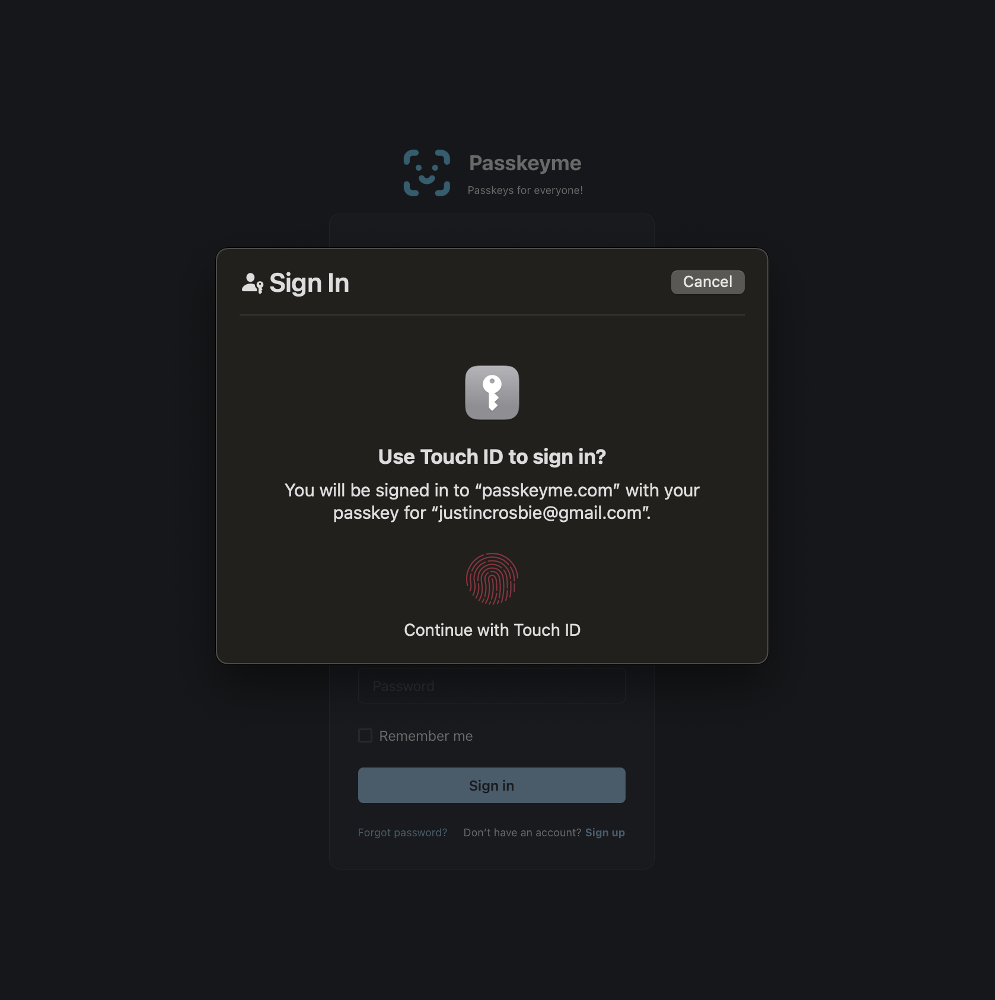
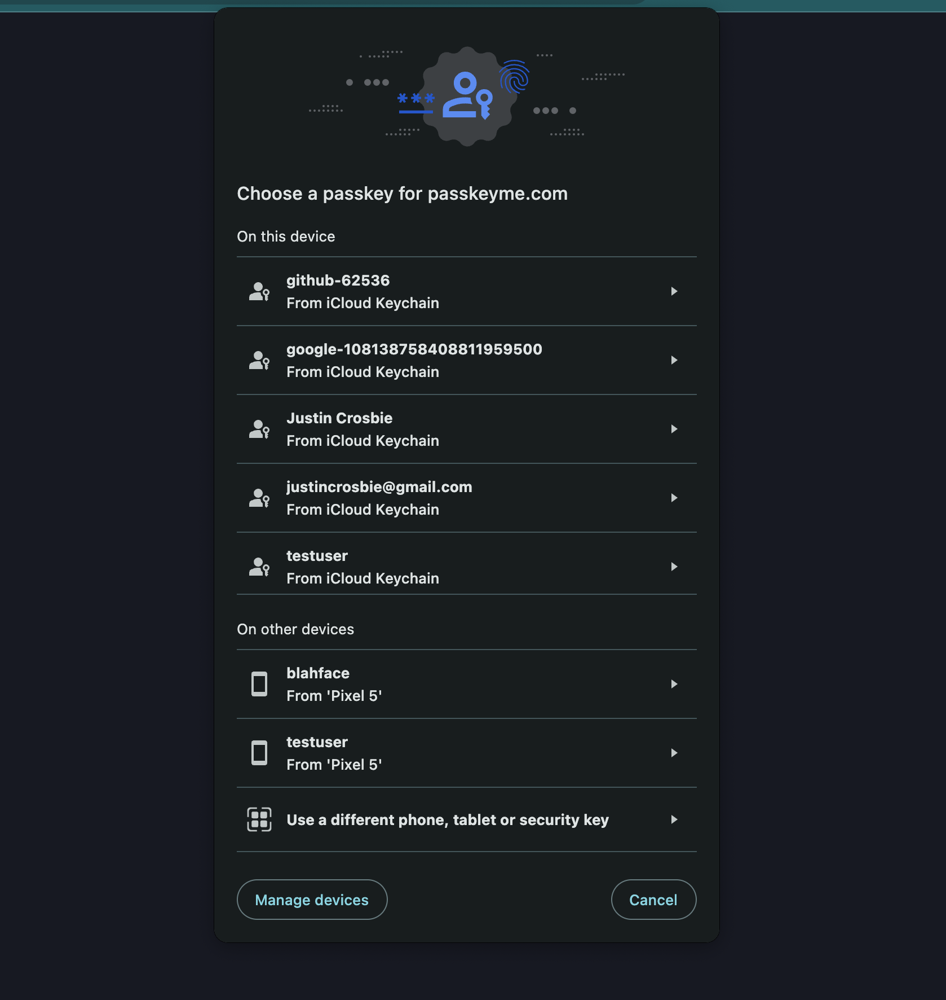
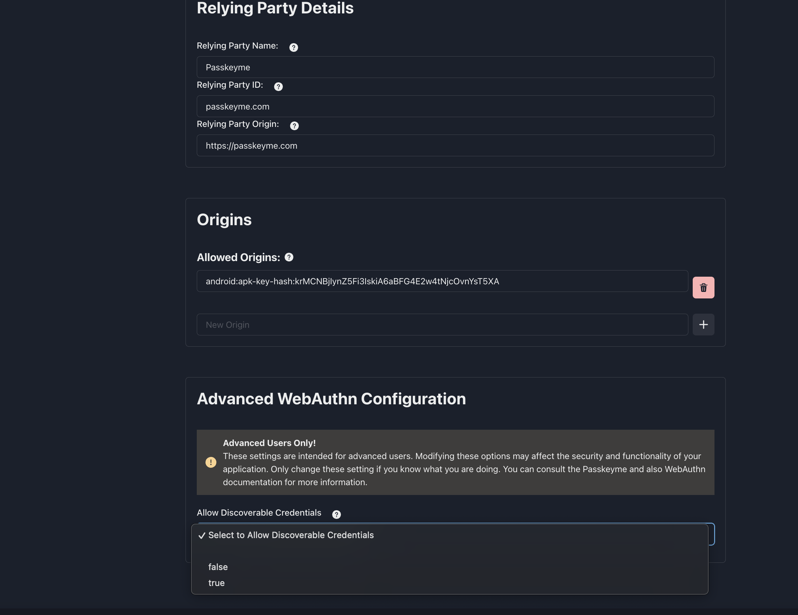

# Passkeyme supports Discoverable Credentials!!

Passkeyme now supports Discoverable Credentials! This new feature takes user authentication to the next level, providing a more seamless and secure experience for your users. 🚀

## What are Discoverable Credentials?

Discoverable Credentials, also known as Resident Keys, allow users to authenticate without needing to remember and enter their username. This is a significant improvement over non-discoverable credentials, where users must input their username every time they log in. With discoverable credentials, the authentication dialog will automatically display all available credentials for the user to choose from.

### Non-Discoverable Credentials


### Discoverable Credentials


## Pros and Cons of Discoverable Credentials

### Pros
- **User Convenience:** Users don’t need to remember and type their usernames. They can simply select their credential from a list.
- **Enhanced Security:** Reduces the risk of phishing attacks as users do not type their usernames, which could be intercepted by malicious actors.
- **Improved User Experience:** Faster and easier authentication process.

### Cons

There are normally some downsides to using discoverable credentials, however Passkeyme takes care of these for you! 

This includes:
- **Storage Requirements:** Discoverable credentials need to be stored securely on the device - but Passkeyme takes care of storage of the credential, securely, and anonymously!
- **Complexity:** Implementing and managing discoverable credentials can add complexity to the authentication process - except if you use Passkeyme, and then its a breeze!

- **Device Dependency:** If a user loses their device, they could lose access to their credentials unless they have a backup method - this is still true, however with Passkeyme:
    - The user can still enter their username, and use non-discoverale mode and get access to their Passkey
    - Fallback-flow is being built as we speak - watch this space!

- **Comparatively worse UX:** Compared to non-discoverable, discoverable credentials require the user to select the correct passkey, which is an extra step. If it is possible to use non-discoverable credentials, this is recommended - i.e. if the username is cached on the device, or can be input buy the user

## How to Enable Discoverable Credentials in Passkeyme

Activating discoverable credentials in Passkeyme is simple. Follow these steps:

### Step 1: Edit the Application
Navigate to your application settings in the Passkeyme dashboard and click on "Edit Application".

### Step 2: Set the "Allow discoverable credentials" Flag
In the application settings, set the "Allow discoverable credentials" flag to true.



### Step 3: Modify Your Authentication Requests
When sending authentication requests, ensure that you do not include a username in your POST requests to `/start_authentication` and `/end_authentication`.

Note, even with Discoverable enabled, you can still trigger a non-discoverable (which is less prone to device-specific operability issues) by specifying the username. If the username is known - i.e. if its a device that has previously logged in with the passkey and you have stored the username locally, we reccommend to use non-discoverable credentials so the user does not have to select their username from the Passkey dialog, which is cleaner.


```json
POST /start_authentication
{
}
```

```json
POST /complete_authentication
{
    "credential": "...."
}
```

