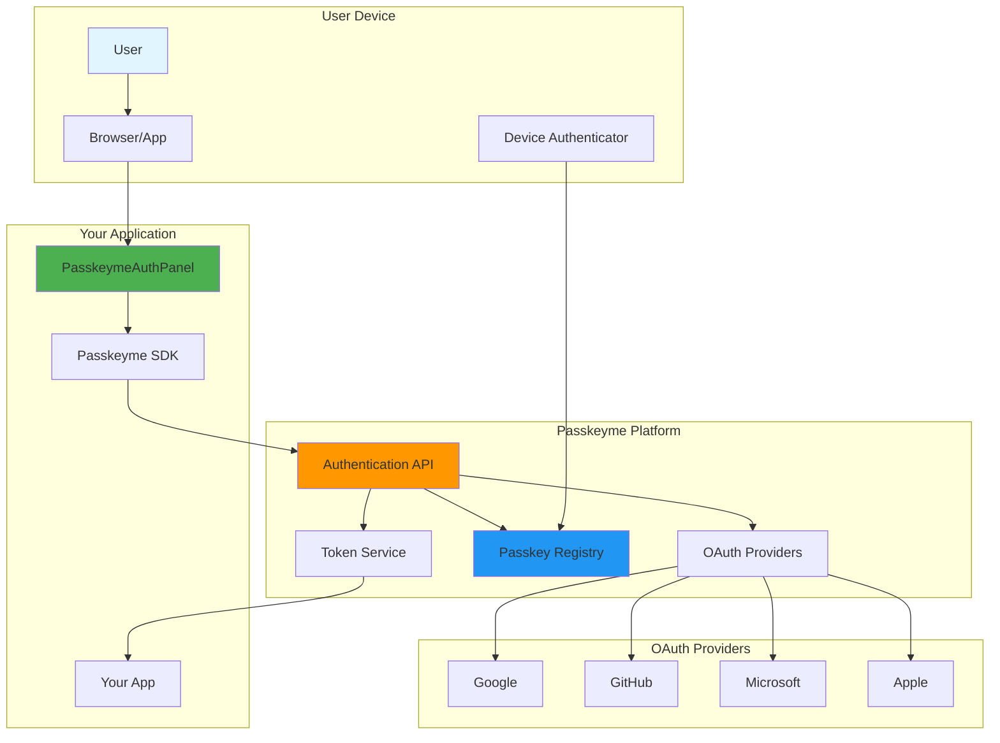
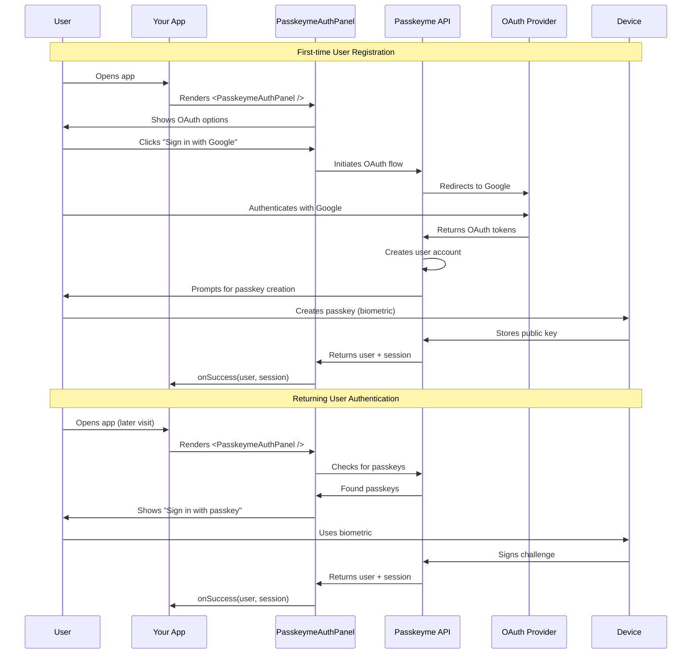
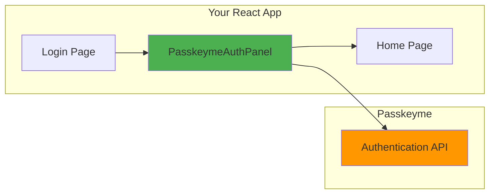
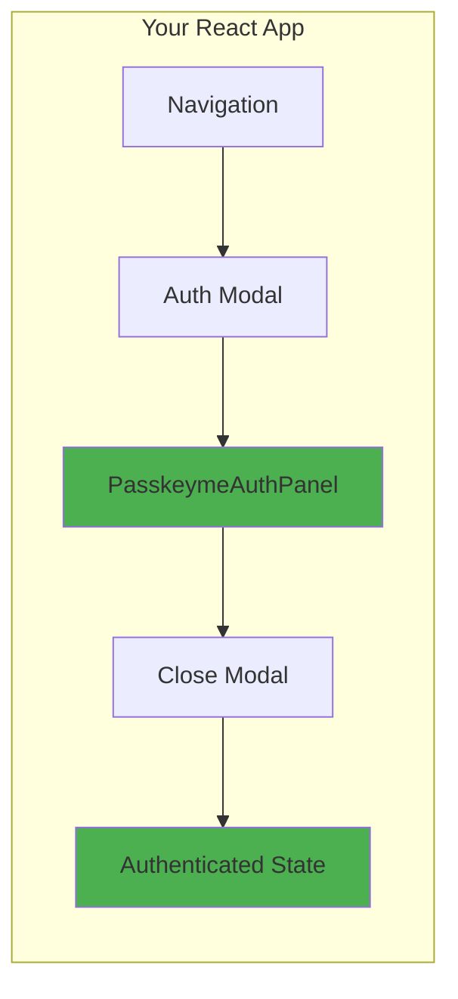
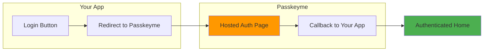
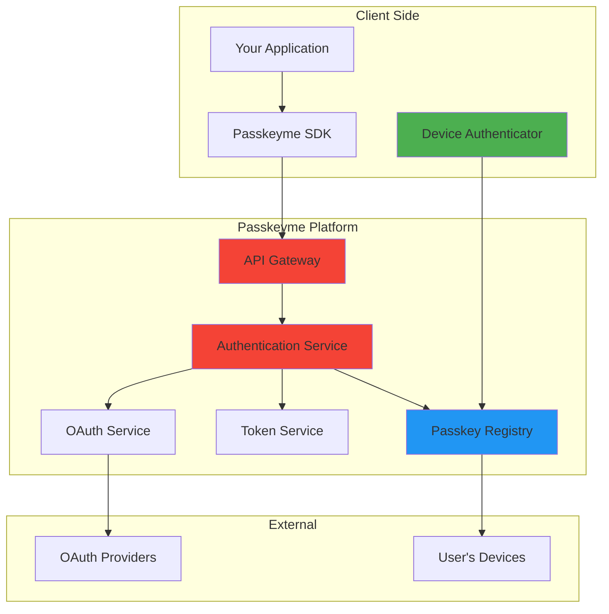
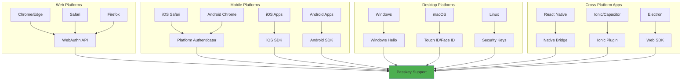

# 🏗️ Architecture Overview

Visual guide to Passkeyme's architecture, integration patterns, and decision flows.

## 🔄 SDK Hierarchy

```mermaid
graph TB
    subgraph "High-Level SDKs (Framework-Specific)"
        A[React SDK ✅] --> AA[PasskeymeAuthPanel]
        A --> AB[PasskeymeOAuthButton]
        B[React Native SDK 🚧] --> BA[Native Components]
        C[Angular SDK 🚧] --> CA[Angular Directives]
        D[Ionic SDK 🚧] --> DA[Ionic Components]
    end
    
    subgraph "Mid-Level SDK (Web)"
        E[JavaScript SDK] --> EA[smartLogin()]
        E --> EB[Hosted Pages]
    end
    
    subgraph "Low-Level SDKs (Platform)"
        F[Web SDK] --> FA[WebAuthn API]
        G[iOS SDK] --> GA[AuthenticationServices]
        H[Android SDK] --> HA[FIDO2 API]
        I[Ionic Plugin] --> IA[Capacitor Bridge]
    end
    
    subgraph "Passkeyme Backend"
        J[Authentication API] --> JA[OAuth Providers]
        J --> JB[Passkey Registry]
        J --> JC[Token Management]
    end
    
    AA --> J
    AB --> J
    EA --> J
    FA --> J
    GA --> J
    HA --> J
    IA --> J
    
    style A fill:#4CAF50
    style E fill:#FF9800
    style F fill:#2196F3
    style G fill:#2196F3
    style H fill:#2196F3
    style I fill:#2196F3
```

## 🎯 Developer Decision Flow

```mermaid
graph TD
    START[New Integration] --> FRAMEWORK{What framework?}
    
    FRAMEWORK -->|React| REACT[React SDK ✅]
    FRAMEWORK -->|React Native| RN[React Native SDK 🚧]
    FRAMEWORK -->|Angular| ANG[Angular SDK 🚧]
    FRAMEWORK -->|Vue/Svelte/Other| JS[JavaScript SDK]
    
    REACT --> CONTROL{Control vs Speed?}
    CONTROL -->|Maximum Control| INLINE[Inline Components]
    CONTROL -->|Rapid Setup| HOSTED[Hosted Pages]
    
    JS --> JSHOSTED[Hosted Pages Only]
    
    INLINE --> AUTHPANEL[PasskeymeAuthPanel]
    INLINE --> OAUTHBTN[PasskeymeOAuthButton]
    
    HOSTED --> SMARTLOGIN[smartLogin() function]
    JSHOSTED --> SMARTLOGIN
    
    AUTHPANEL --> SUCCESS[✅ Production Ready]
    OAUTHBTN --> SUCCESS
    SMARTLOGIN --> SUCCESS
    
    RN --> WAIT[Wait for SDK 🚧]
    ANG --> WAIT
    WAIT --> JS
    
    style REACT fill:#4CAF50
    style JS fill:#FF9800
    style SUCCESS fill:#4CAF50
    style WAIT fill:#FFC107
```

## 🔐 Authentication Architecture



## 🔄 Authentication Lifecycle



## 🎨 Integration Patterns

### Pattern 1: Embedded Authentication



### Pattern 2: Modal/Dialog Authentication



### Pattern 3: Hosted Pages (Non-React)



## 🔒 Security Architecture



## 📱 Cross-Platform Support Matrix



---

## 🔗 Related Documentation

- **[Concepts](./concepts.md)** - Core Passkeyme concepts
- **[Choosing Your Approach](./choosing-approach.md)** - Integration decision guide
- **[Framework Comparison](./framework-comparison.md)** - Feature comparison matrix
- **[Glossary](../glossary.md)** - Terminology reference

---

*These diagrams provide a visual overview of Passkeyme's architecture and integration patterns. For implementation details, see the framework-specific documentation.*
