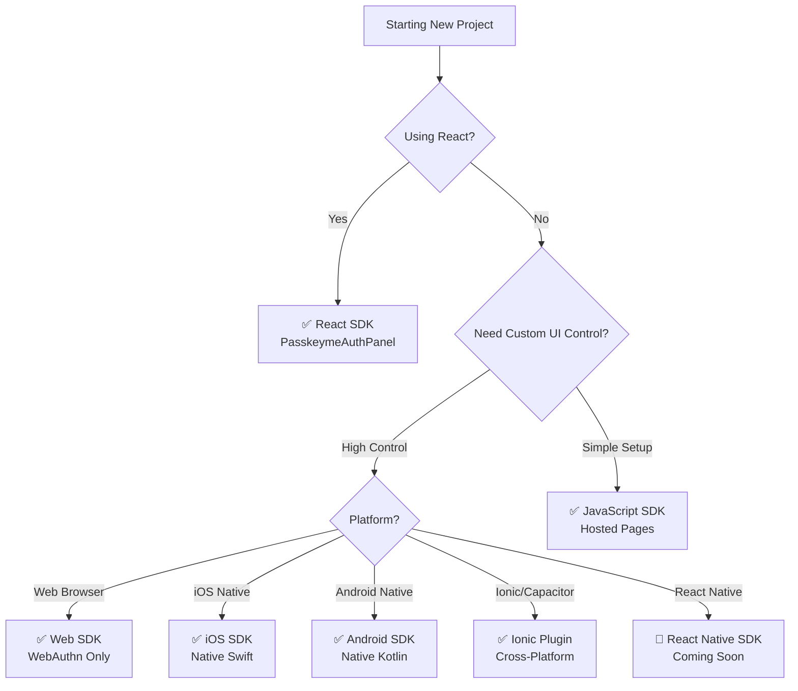

# 🎯 Choosing Your Authentication Approach

PasskeyMe offers multiple integration approaches to fit different project needs, technical requirements, and developer preferences. This guide helps you choose the right approach for your specific situation.

## 🚀 Quick Decision Tree



## 📊 Integration Approach Comparison

| Approach | Best For | Setup Time | UI Control | OAuth Support | Passkey Support |
|----------|----------|------------|------------|---------------|-----------------|
| **[React SDK](/docs/sdks/react)** | React apps | ⚡ Fast | 🎨 High | ✅ Full | ✅ Full |
| **[JavaScript SDK](/docs/sdks/javascript)** | Other frameworks | ⚡ Fast | 🎨 Medium | ✅ Full | ✅ Full |
| **[Web SDK](/docs/sdks/web-sdk)** | Custom implementations | 🔧 Medium | 🎨 Total | ❌ None | ✅ Full |
| **[iOS SDK](/docs/sdks/ios-sdk)** | Native iOS apps | 🔧 Medium | 🎨 Total | ❌ None | ✅ Full |
| **[Android SDK](/docs/sdks/android-sdk)** | Native Android apps | 🔧 Medium | 🎨 Total | ❌ None | ✅ Full |
| **[Ionic Plugin](/docs/sdks/ionic-plugin)** | Ionic/Capacitor apps | 🔧 Medium | 🎨 High | ❌ None | ✅ Full |
| **[Direct API](/docs/api/api-overview)** | Custom backends | 🛠️ Complex | 🎨 Total | ✅ Full | ✅ Full |

## 🎨 UI Control vs Simplicity Matrix

### **High-Level SDKs** (Recommended for Most Projects)

#### ✅ **React SDK** - Best Developer Experience
**Perfect for:** React applications needing inline authentication

```jsx
import { PasskeymeAuthPanel } from '@passkeyme/react-auth';

function App() {
  return (
    <PasskeymeAuthPanel
      onSuccess={(user) => console.log('Authenticated:', user)}
      providers={['google', 'github', 'passkey']}
      theme="light"
    />
  );
}
```

**Pros:**
- ✅ **One component** handles everything
- ✅ **Built-in OAuth** (Google, GitHub, Facebook)
- ✅ **Passkey authentication** included
- ✅ **Customizable theming** and styling
- ✅ **TypeScript support** out of the box
- ✅ **Production-ready** with error handling

**Cons:**
- ❌ **React only** (other frameworks coming soon)
- ❌ **Less control** over individual auth steps

**Use When:**
- Building a React application
- Want fastest time to implementation
- Need both OAuth and passkey support
- Prefer component-based architecture

---

#### ✅ **JavaScript SDK** - Framework Agnostic
**Perfect for:** Angular, Vue, Svelte, or vanilla JavaScript applications

```javascript
import { smartLogin } from '@passkeyme/auth';

async function handleLogin() {
  try {
    const user = await smartLogin({
      providers: ['google', 'github', 'passkey'],
      mode: 'popup' // or 'redirect'
    });
    console.log('Authenticated:', user);
  } catch (error) {
    console.error('Authentication failed:', error);
  }
}
```

**Pros:**
- ✅ **Framework agnostic** - works everywhere
- ✅ **OAuth + passkey** support included
- ✅ **Hosted pages** handle complex UI
- ✅ **Quick integration** with minimal code
- ✅ **Customizable** branding and styling

**Cons:**
- ❌ **Less UI control** than React SDK
- ❌ **Popup/redirect** flow required
- ❌ **External dependency** on hosted pages

**Use When:**
- Using Angular, Vue, Svelte, or vanilla JS
- Want simple integration without complex UI
- Need both OAuth and passkey support
- Okay with popup/redirect authentication flow

### **Low-Level SDKs** (Maximum Control)

#### 🔧 **Platform-Specific SDKs** - Passkey Ceremonies Only
**Perfect for:** Developers who need fine-grained control over authentication UI and flows

**Available Platforms:**
- **[Web SDK](/docs/sdks/web-sdk)** - Browser WebAuthn
- **[iOS SDK](/docs/sdks/ios-sdk)** - Native Swift/Objective-C
- **[Android SDK](/docs/sdks/android-sdk)** - Native Kotlin/Java
- **[Ionic Plugin](/docs/sdks/ionic-plugin)** - Capacitor integration

```javascript
// Web SDK Example
import { PasskeymeWebSDK } from 'passkeyme-web-sdk';

const sdk = new PasskeymeWebSDK();

// Manual registration flow
const credential = await sdk.register({
  username: 'user@example.com',
  challenge: challengeFromBackend,
  // ... WebAuthn options
});

// Send credential to your backend for verification
await yourBackend.verifyRegistration(credential);
```

**Pros:**
- ✅ **Complete control** over UI and flows
- ✅ **Native platform** integration
- ✅ **No external dependencies** on hosted pages
- ✅ **Custom backend** integration
- ✅ **Minimal package size** (passkeys only)

**Cons:**
- ❌ **No OAuth support** (passkeys only)
- ❌ **More implementation** work required
- ❌ **Backend integration** required
- ❌ **Manual error handling** needed

**Use When:**
- Building native mobile apps
- Need complete control over authentication UI
- Have existing OAuth implementation
- Want to minimize external dependencies
- Have backend development resources

## 🏗️ Architecture Decision Factors

### **Project Type Considerations**

#### **📱 Mobile Applications**
- **React Native**: Use **React Native SDK** (coming soon) or **Web SDK** in WebView
- **Native iOS**: Use **[iOS SDK](/docs/sdks/ios-sdk)** for native integration
- **Native Android**: Use **[Android SDK](/docs/sdks/android-sdk)** for native integration
- **Ionic/Capacitor**: Use **[Ionic Plugin](/docs/sdks/ionic-plugin)** for cross-platform

#### **🌐 Web Applications**
- **React**: Use **[React SDK](/docs/sdks/react)** (recommended)
- **Angular/Vue/Svelte**: Use **[JavaScript SDK](/docs/sdks/javascript)** or **[Web SDK](/docs/sdks/web-sdk)**
- **Server-side rendered**: Use **[JavaScript SDK](/docs/sdks/javascript)** with redirect flow

#### **🔧 Custom/Enterprise**
- **Custom backend**: Use **[Direct API](/docs/api/api-overview)** integration
- **Microservices**: Use **[Web SDK](/docs/sdks/web-sdk)** + **[API](/docs/api/api-overview)**
- **White-label**: Use **[Web SDK](/docs/sdks/web-sdk)** for complete control

### **Team Capability Considerations**

#### **Frontend-Focused Teams**
- **High-level SDKs** (React SDK, JavaScript SDK)
- **Hosted authentication pages** for simplicity
- **Minimal backend integration** required

#### **Full-Stack Teams**
- **Mid-level SDKs** (Web SDK, Ionic Plugin)
- **Custom backend integration** possible
- **Balanced control vs complexity**

#### **Platform/Infrastructure Teams**
- **Low-level SDKs** or **Direct API**
- **Complete customization** capability
- **Maximum integration flexibility**

## 🚦 Migration Paths

### **From Passwords to Passkeys**

#### **Phase 1: Add Passkey Option**
```javascript
// Add passkey as additional auth method
<PasskeymeAuthPanel
  providers={['password', 'passkey']} // Keep existing password
  onSuccess={handleAuth}
/>
```

#### **Phase 2: Passkey-First**
```javascript
// Promote passkey as primary method
<PasskeymeAuthPanel
  providers={['passkey', 'password']} // Passkey first
  defaultProvider="passkey"
  onSuccess={handleAuth}
/>
```

#### **Phase 3: Passkey-Only**
```javascript
// Remove password dependency
<PasskeymeAuthPanel
  providers={['passkey']}
  onSuccess={handleAuth}
/>
```

### **From OAuth-Only to Passkeys**

#### **Current: OAuth Only**
```javascript
<PasskeymeAuthPanel
  providers={['google', 'github']}
  onSuccess={handleAuth}
/>
```

#### **Enhanced: OAuth + Passkeys**
```javascript
<PasskeymeAuthPanel
  providers={['passkey', 'google', 'github']} // Add passkey
  onSuccess={handleAuth}
/>
```

## 🎯 Recommendation Engine

### **✅ Choose React SDK if:**
- Using React 16.8+ with hooks
- Want fastest time to implementation
- Need both OAuth and passkey support
- Prefer component-based architecture
- Want built-in theming and customization

### **✅ Choose JavaScript SDK if:**
- Using Angular, Vue, Svelte, or vanilla JS
- React SDK not available for your framework
- Want simple popup/redirect authentication
- Need both OAuth and passkey support
- Okay with hosted authentication pages

### **✅ Choose Web SDK if:**
- Need complete control over authentication UI
- Building custom authentication flows
- Want passkey-only implementation
- Have existing OAuth infrastructure
- Minimizing external dependencies

### **✅ Choose Platform SDKs if:**
- Building native mobile applications
- Need platform-specific integrations
- Want optimal performance and UX
- Have platform development expertise

### **✅ Choose Direct API if:**
- Building microservices architecture
- Need maximum customization
- Have dedicated backend team
- Implementing white-label solutions

## 📚 Next Steps

Based on your decision:

### **React SDK** → **[React Quick Start](/docs/getting-started/quick-start#react-quick-start)**
### **JavaScript SDK** → **[JavaScript Quick Start](/docs/getting-started/quick-start#javascript-quick-start)**
### **Web SDK** → **[Web SDK Documentation](/docs/sdks/web-sdk)**
### **Mobile SDKs** → **[Platform SDKs Overview](/docs/sdks/low-level-overview)**
### **API Integration** → **[API Documentation](/docs/api/api-overview)**

---

:::tip Still Unsure?
Start with the **[React SDK](/docs/sdks/react)** if you're using React, or the **[JavaScript SDK](/docs/sdks/javascript)** for other frameworks. These provide the fastest path to success and can be replaced with lower-level SDKs later if needed.
:::

:::info Framework Roadmap
**Coming Soon:**
- React Native SDK (Q1 2025)
- Angular SDK (Q2 2025)  
- Vue SDK (Q2 2025)
- Svelte SDK (Q3 2025)

Join our **[Discord community](https://discord.gg/passkeyme)** for updates!
:::
