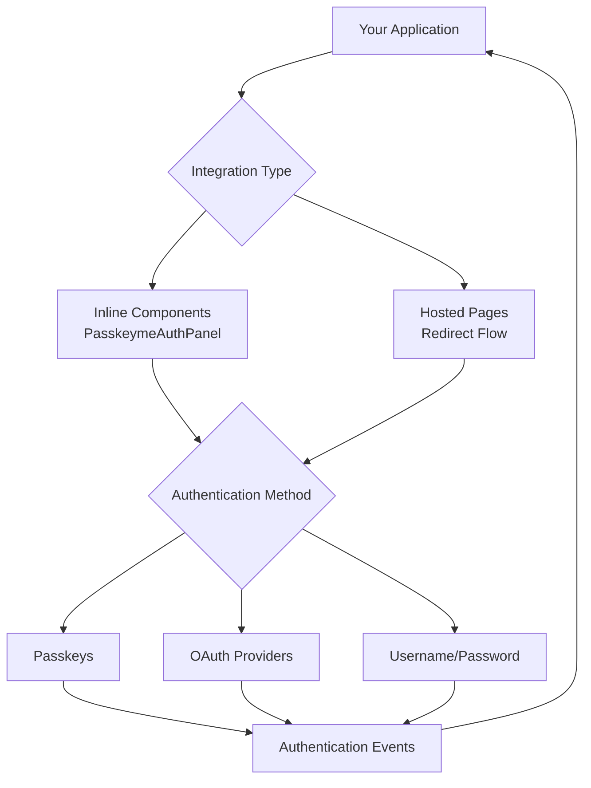

# 🧠 Core Concepts

Understanding these fundamental concepts will help you make the most of PasskeyMe and implement authentication effectively.

## Authentication Architecture

### Inline Components vs Hosted Pages

PasskeyMe offers **two primary integration approaches** to fit different application needs:

#### Inline Components (Recommended for React)
- **`PasskeymeAuthPanel`** React component for embedded authentication
- **Complete control** over user experience and styling
- **Event-driven** authentication with `onSuccess`, `onError` callbacks
- **Customizable theming** and layout options
- **No redirects** - authentication happens within your app

#### Hosted Authentication Pages
- **Redirect-based** authentication for non-React frameworks
- **Zero UI maintenance** - we handle the interface
- **Automatic updates** for new features and security patches
- **Cross-application** consistent branding

### Choosing Your Approach

| Requirement | Inline Components | Hosted Pages |
|-------------|------------------|--------------|
| **React Application** | ✅ Recommended | ⚠️ Alternative |
| **Custom Styling** | ✅ Full control | ⚠️ Limited theming |
| **No Redirects** | ✅ Embedded auth | ❌ Redirect required |
| **Rapid Integration** | ⚠️ Some setup | ✅ Minimal code |
| **Non-React Framework** | ❌ Not available | ✅ JavaScript SDK |



### Authentication Flow

#### Inline Components Flow
1. **Component render**: `<PasskeymeAuthPanel />` renders in your app
2. **User interaction**: User selects authentication method
3. **Authentication**: User completes authentication within component
4. **Event callback**: `onSuccess(user)` called with authenticated user
5. **Session**: Your app handles authenticated user state

#### Hosted Pages Flow  
1. **Initiation**: User clicks login in your app
2. **Redirect**: User is redirected to PasskeyMe hosted page
3. **Authentication**: User completes authentication using their preferred method
4. **Callback**: User is redirected back to your app with secure tokens
5. **Session**: Your app uses JWT tokens for authenticated requests

## Authentication Methods

### 🔐 Passkeys (Primary)

**What are passkeys?**
- Modern replacement for passwords using public-key cryptography
- Stored securely on user's device (phone, laptop, security key)
- Phishing-resistant and can't be reused across sites
- Backed by Apple, Google, Microsoft, and the FIDO Alliance

**Benefits:**
- **Security**: Impossible to phish or steal
- **Convenience**: Biometric authentication (Face ID, Touch ID, Windows Hello)
- **Universal**: Works across all modern devices and browsers
- **Privacy**: No shared secrets with servers

### 🌐 OAuth Providers

**Supported providers:**
- Google
- GitHub  
- Microsoft
- Apple
- Discord
- More providers added regularly

**Configuration:**
- Set up OAuth apps in provider dashboards
- Configure redirect URIs in PasskeyMe dashboard
- OAuth secrets stored securely server-side (never exposed to clients)

### 🔑 Username/Password (Fallback)

**When to use:**
- Fallback for users without passkey-compatible devices
- Enterprise environments with specific requirements
- Gradual migration from existing password systems

**Security features:**
- Bcrypt password hashing
- Rate limiting and brute force protection
- Optional multi-factor authentication

## JWT Token System

### Access Tokens

**Purpose**: Authorize API requests to your backend
- **Lifetime**: Short (15 minutes - 1 hour)
- **Usage**: Include in `Authorization: Bearer <token>` headers
- **Auto-refresh**: SDK automatically refreshes when needed

### Refresh Tokens

**Purpose**: Obtain new access tokens without re-authentication
- **Lifetime**: Long (days to weeks)
- **Storage**: Secure HTTP-only cookies (recommended) or localStorage
- **Rotation**: New refresh token issued with each refresh

### Token Security

**Best practices implemented:**
- **Short access token lifetime** limits exposure window
- **Automatic token refresh** maintains seamless user experience
- **Secure storage options** for different application types
- **Token rotation** prevents replay attacks

## User Identity & Profiles

### User Object Structure

```typescript
interface User {
  id: string;           // Unique user identifier
  email: string;        // Primary email address
  emailVerified: boolean; // Email verification status
  name?: string;        // Display name
  picture?: string;     // Profile picture URL
  createdAt: string;    // Account creation timestamp
  lastLoginAt: string;  // Last login timestamp
  
  // Authentication methods used
  authMethods: {
    passkey: boolean;
    oauth: string[];    // ['google', 'github']
    password: boolean;
  };
}
```

### User Lifecycle

**Registration:**
- User completes first authentication
- User record created with chosen method
- Email verification (if using email)

**Authentication:**
- User logs in with any configured method
- Existing user record updated
- New authentication methods can be added

**Profile Management:**
- Users can add/remove authentication methods
- Profile information synced from OAuth providers
- Account linking across different auth methods

## Security Model

### Passkey Security

**Device-bound credentials:**
- Private keys never leave the user's device
- Biometric or PIN authentication required
- Works with platform authenticators (built-in) or roaming authenticators (USB keys)

**Phishing resistance:**
- Cryptographic origin binding prevents use on wrong domains
- No shared secrets that can be stolen
- Man-in-the-middle attacks are ineffective

### OAuth Security

**Server-side implementation:**
- OAuth client secrets stored on PasskeyMe servers
- Authorization code flow with PKCE
- State parameter for CSRF protection
- Nonce handling for OpenID Connect

### Transport Security

**HTTPS everywhere:**
- All communication encrypted in transit
- Secure cookie settings for tokens
- HSTS headers for enhanced security
- Certificate pinning for API calls

## Multi-Application Support

### Single Sign-On (SSO)

**Cross-application authentication:**
- User authenticates once across all your applications
- Shared session management
- Centralized user profile and preferences

**Implementation:**
- Same App ID across all applications
- Consistent redirect URI patterns
- Shared JWT signing keys

### Application Isolation

**When needed:**
- Different user bases for different applications
- Separate branding requirements
- Different security policies

**Implementation:**
- Separate App IDs for each application
- Independent user databases
- Custom authentication flows

## Development vs Production

### Development Environment

**Localhost support:**
- Passkeys work over HTTP on localhost
- Relaxed CORS policies for development
- Debug logging enabled
- Development-specific OAuth redirect URIs

### Production Environment

**Security requirements:**
- HTTPS required for passkeys
- Proper CORS configuration
- Production OAuth apps and redirect URIs
- Monitoring and alerting setup

**Performance considerations:**
- CDN for SDK delivery
- Token caching strategies
- Optimized API endpoints
- Geographic distribution

## Migration Strategies

### From Password-Only Systems

1. **Parallel authentication**: Keep existing login alongside PasskeyMe
2. **Gradual migration**: Encourage users to add passkeys
3. **Account linking**: Connect existing accounts to PasskeyMe users
4. **Data migration**: Transfer user profiles and preferences

### From Other Auth Providers

1. **Email matching**: Link accounts by verified email addresses
2. **OAuth provider mapping**: Maintain connections to existing OAuth accounts
3. **Gradual transition**: Support both systems during migration
4. **User communication**: Clear messaging about the transition

## Best Practices

### User Experience

- **Progressive enhancement**: Start with familiar methods, introduce passkeys
- **Clear messaging**: Explain benefits of passkeys to users
- **Fallback options**: Always provide alternative authentication methods
- **Responsive design**: Authentication works well on all devices

### Security

- **Regular updates**: Keep SDKs updated for latest security patches
- **Monitor authentication**: Log and alert on suspicious authentication patterns
- **User education**: Help users understand passkey security benefits
- **Incident response**: Plan for security incident response procedures

### Performance

- **Lazy loading**: Load authentication components only when needed
- **Caching**: Cache user data appropriately
- **Error handling**: Graceful degradation for authentication failures
- **Monitoring**: Track authentication success rates and performance

## Next Steps

- **[Quick Start Guide](/docs/getting-started/quick-start)** - Build your first integration
- **[Installation](/docs/getting-started/installation)** - Detailed setup instructions
- **[Configuration](/docs/configuration/authentication-methods)** - Configure authentication options
- **[SDK Reference](/docs/sdks/javascript)** - Explore SDK features
