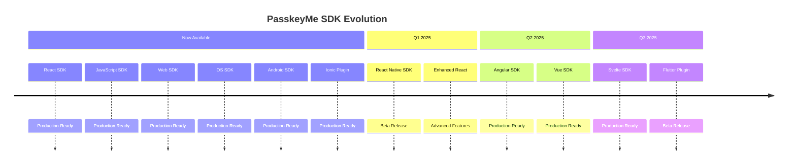

# 📊 Framework Comparison Matrix

This comprehensive comparison helps you understand the capabilities, integration complexity, and current availability of PasskeyMe SDKs across different frameworks and platforms.

## 🎯 High-Level SDK Comparison

| Framework | SDK Package | Status | OAuth Support | Passkey Support | UI Components | Setup Time | Docs |
|-----------|-------------|--------|---------------|-----------------|---------------|------------|------|
| **React** | `@passkeyme/react-auth` | ✅ **Available** | ✅ Full | ✅ Full | ✅ Rich | ⚡ 5 min | **[Docs](/docs/sdks/react)** |
| **Angular** | `@passkeyme/angular` | 🚧 **Q2 2025** | ✅ Full | ✅ Full | ✅ Rich | ⚡ 5 min | Coming Soon |
| **Vue** | `@passkeyme/vue` | 🚧 **Q2 2025** | ✅ Full | ✅ Full | ✅ Rich | ⚡ 5 min | Coming Soon |
| **Svelte** | `@passkeyme/svelte` | 🚧 **Q3 2025** | ✅ Full | ✅ Full | ✅ Rich | ⚡ 5 min | Coming Soon |
| **React Native** | `@passkeyme/react-native` | 🚧 **Q1 2025** | ✅ Full | ✅ Full | ✅ Rich | ⚡ 10 min | Coming Soon |

### **Current Alternative: JavaScript SDK**

For frameworks without dedicated SDKs, use the **JavaScript SDK**:

| Framework | Integration Method | OAuth Support | Passkey Support | UI Control | Setup Time | Docs |
|-----------|-------------------|---------------|-----------------|------------|------------|------|
| **Angular** | JavaScript SDK | ✅ Full | ✅ Full | 🎨 Medium | ⚡ 10 min | **[Docs](/docs/sdks/javascript)** |
| **Vue** | JavaScript SDK | ✅ Full | ✅ Full | 🎨 Medium | ⚡ 10 min | **[Docs](/docs/sdks/javascript)** |
| **Svelte** | JavaScript SDK | ✅ Full | ✅ Full | 🎨 Medium | ⚡ 10 min | **[Docs](/docs/sdks/javascript)** |
| **Vanilla JS** | JavaScript SDK | ✅ Full | ✅ Full | 🎨 Medium | ⚡ 10 min | **[Docs](/docs/sdks/javascript)** |

## 🔧 Low-Level SDK Comparison

| Platform | SDK Package | Language | OAuth Support | Passkey Support | Integration | Setup Time | Docs |
|----------|-------------|----------|---------------|-----------------|-------------|------------|------|
| **Web Browser** | `passkeyme-web-sdk` | JavaScript/TypeScript | ❌ Manual | ✅ Full | 🔧 Custom | 🛠️ 30 min | **[Docs](/docs/sdks/web-sdk)** |
| **iOS Native** | `PasskeymeSDK` | Swift/Objective-C | ❌ Manual | ✅ Full | 🔧 Custom | 🛠️ 45 min | **[Docs](/docs/sdks/ios-sdk)** |
| **Android Native** | `passkeyme-android-sdk` | Kotlin/Java | ❌ Manual | ✅ Full | 🔧 Custom | 🛠️ 45 min | **[Docs](/docs/sdks/android-sdk)** |
| **Ionic/Capacitor** | `@passkeyme/ionic-cap-plugin` | TypeScript | ❌ Manual | ✅ Full | 🔧 Medium | 🛠️ 30 min | **[Docs](/docs/sdks/ionic-plugin)** |

## 📱 Mobile Platform Comparison

### **React Native vs Native Development**

| Approach | Development Speed | Performance | Platform Features | Maintenance |
|----------|------------------|-------------|-------------------|-------------|
| **React Native SDK** 🚧 | ⚡ Fast | 🔥 Good | 📱 Most | 🔄 Single Codebase |
| **iOS SDK** ✅ | 🛠️ Medium | 🚀 Excellent | 📱 All | 🔄 Per Platform |
| **Android SDK** ✅ | 🛠️ Medium | 🚀 Excellent | 📱 All | 🔄 Per Platform |
| **Ionic Plugin** ✅ | ⚡ Fast | 🔥 Good | 📱 Most | 🔄 Single Codebase |

### **Platform-Specific Features**

| Feature | iOS SDK | Android SDK | React Native | Ionic Plugin |
|---------|---------|-------------|--------------|--------------|
| **Face ID/Touch ID** | ✅ Native | ✅ Biometric | 🚧 Planned | ✅ Supported |
| **Keychain Integration** | ✅ Full | ✅ Full | 🚧 Planned | ✅ Supported |
| **Background Auth** | ✅ Supported | ✅ Supported | 🚧 Planned | ✅ Supported |
| **Deep Linking** | ✅ Supported | ✅ Supported | 🚧 Planned | ✅ Supported |
| **Push Notifications** | ✅ Supported | ✅ Supported | 🚧 Planned | ✅ Supported |

## 🌐 Web Framework Deep Dive

### **React Ecosystem**

| Framework | SDK Status | Implementation | Notes |
|-----------|------------|----------------|-------|
| **React** | ✅ **Available** | `<PasskeymeAuthPanel />` | Primary focus, full feature set |
| **Next.js** | ✅ **Supported** | React SDK + SSR patterns | Server-side rendering supported |
| **Gatsby** | ✅ **Supported** | React SDK + static patterns | Static site generation supported |
| **Remix** | ✅ **Supported** | React SDK + loader patterns | Full-stack React framework supported |

### **Angular Ecosystem**

| Framework | SDK Status | Current Alternative | Planned Release |
|-----------|------------|-------------------|-----------------|
| **Angular** | 🚧 **Q2 2025** | JavaScript SDK | Dedicated Angular SDK |
| **Angular Universal** | 🚧 **Q2 2025** | JavaScript SDK | SSR support planned |
| **Ionic Angular** | ✅ **Available** | Ionic Plugin | Cross-platform mobile |

### **Vue Ecosystem**

| Framework | SDK Status | Current Alternative | Planned Release |
|-----------|------------|-------------------|-----------------|
| **Vue 3** | 🚧 **Q2 2025** | JavaScript SDK | Composition API support |
| **Nuxt.js** | 🚧 **Q2 2025** | JavaScript SDK | SSR/SSG support planned |
| **Quasar** | 🚧 **Q3 2025** | JavaScript SDK | Cross-platform framework |

## 🔄 Integration Patterns by Framework

### **Component-Based Frameworks**

#### **React (Available Now)**
```jsx
import { PasskeymeAuthPanel } from '@passkeyme/react-auth';

function LoginPage() {
  return (
    <PasskeymeAuthPanel
      providers={['google', 'github', 'passkey']}
      onSuccess={(user) => setUser(user)}
      theme="light"
    />
  );
}
```

#### **Angular (Coming Q2 2025)**
```typescript
// Future Angular SDK
import { PasskeymeModule } from '@passkeyme/angular';

@Component({
  template: `
    <passkeyme-auth-panel
      [providers]="['google', 'github', 'passkey']"
      (success)="onSuccess($event)"
      theme="light">
    </passkeyme-auth-panel>
  `
})
export class LoginComponent { }
```

#### **Vue (Coming Q2 2025)**
```vue
<!-- Future Vue SDK -->
<template>
  <PasskeymeAuthPanel
    :providers="['google', 'github', 'passkey']"
    @success="onSuccess"
    theme="light"
  />
</template>

<script setup>
import { PasskeymeAuthPanel } from '@passkeyme/vue';
</script>
```

### **Current Alternative: JavaScript SDK**

#### **Angular Integration**
```typescript
import { smartLogin } from '@passkeyme/auth';

@Component({
  template: `
    <button (click)="handleLogin()" class="login-btn">
      Sign In with Passkey
    </button>
  `
})
export class LoginComponent {
  async handleLogin() {
    const user = await smartLogin({
      providers: ['google', 'github', 'passkey']
    });
    this.authService.setUser(user);
  }
}
```

#### **Vue Integration**
```vue
<template>
  <button @click="handleLogin" class="login-btn">
    Sign In with Passkey
  </button>
</template>

<script setup>
import { smartLogin } from '@passkeyme/auth';

async function handleLogin() {
  const user = await smartLogin({
    providers: ['google', 'github', 'passkey']
  });
  // Handle successful authentication
}
</script>
```

#### **Svelte Integration**
```svelte
<script>
  import { smartLogin } from '@passkeyme/auth';
  
  async function handleLogin() {
    const user = await smartLogin({
      providers: ['google', 'github', 'passkey']
    });
    // Handle successful authentication
  }
</script>

<button on:click={handleLogin} class="login-btn">
  Sign In with Passkey
</button>
```

## 🎨 UI Customization Comparison

| SDK Type | Theming | Custom CSS | Component Props | Layout Control |
|----------|---------|------------|-----------------|----------------|
| **React SDK** | ✅ Built-in | ✅ Full | ✅ Extensive | ✅ Flexible |
| **JavaScript SDK** | ✅ Hosted Pages | 🎨 Limited | ❌ None | 🎨 Limited |
| **Web SDK** | 🔧 Manual | ✅ Full | 🔧 Manual | ✅ Complete |
| **Mobile SDKs** | 🔧 Platform | ✅ Full | 🔧 Platform | ✅ Complete |

### **Theming Examples**

#### **React SDK Theming**
```jsx
const customTheme = {
  colors: {
    primary: '#007bff',
    background: '#ffffff',
    text: '#333333'
  },
  borderRadius: '8px',
  fontFamily: 'Inter, sans-serif'
};

<PasskeymeAuthPanel theme={customTheme} />
```

#### **JavaScript SDK Theming**
```javascript
await smartLogin({
  providers: ['passkey'],
  branding: {
    primaryColor: '#007bff',
    logo: 'https://yoursite.com/logo.png',
    backgroundImage: 'https://yoursite.com/bg.jpg'
  }
});
```

## 📈 Performance Comparison

| Metric | React SDK | JavaScript SDK | Web SDK | Mobile SDKs |
|--------|-----------|----------------|---------|-------------|
| **Bundle Size** | 📦 45KB gzipped | 📦 12KB gzipped | 📦 8KB gzipped | 📱 Native |
| **Load Time** | ⚡ Instant | ⚡ Instant | ⚡ Instant | 📱 Native |
| **Auth Speed** | 🚀 < 2s | 🚀 < 3s | 🚀 < 2s | 🚀 < 1s |
| **Memory Usage** | 💾 Low | 💾 Very Low | 💾 Minimal | 💾 Native |

### **Performance Considerations**

#### **Web Frameworks**
- **React SDK**: Optimized for React rendering, tree-shaking support
- **JavaScript SDK**: Minimal footprint, external hosted pages
- **Web SDK**: Smallest bundle, manual optimization required

#### **Mobile Platforms**
- **Native SDKs**: Optimal performance, platform-specific optimizations
- **React Native**: Near-native performance, single codebase
- **Ionic Plugin**: Good performance, web technology stack

## 🔒 Security Feature Comparison

| Security Feature | High-Level SDKs | Low-Level SDKs | Notes |
|------------------|-----------------|----------------|-------|
| **OAuth Security** | ✅ Built-in | 🔧 Manual | PKCE, state validation |
| **Passkey Security** | ✅ Built-in | ✅ Built-in | WebAuthn standard |
| **Token Management** | ✅ Automatic | 🔧 Manual | JWT refresh, storage |
| **CSRF Protection** | ✅ Built-in | 🔧 Manual | State parameter validation |
| **Secure Storage** | ✅ Built-in | 🔧 Manual | Platform-specific implementation |

## 🛠️ Development Experience

### **Setup Complexity**

| Framework | Initial Setup | Configuration | First Auth | Production Ready |
|-----------|---------------|---------------|------------|------------------|
| **React SDK** | ⚡ 5 min | ⚡ Minimal | ⚡ 2 min | ✅ Immediately |
| **JavaScript SDK** | ⚡ 10 min | ⚡ Simple | ⚡ 5 min | ✅ Immediately |
| **Web SDK** | 🛠️ 30 min | 🔧 Moderate | 🛠️ 15 min | 🔧 Additional Work |
| **Mobile SDKs** | 🛠️ 45 min | 🔧 Platform | 🛠️ 20 min | 🔧 Additional Work |

### **Debugging and Support**

| SDK Type | Debug Tools | Error Messages | Documentation | Community |
|----------|-------------|----------------|---------------|-----------|
| **High-Level** | 🔍 Built-in | 📝 Detailed | 📚 Complete | 👥 Active |
| **Low-Level** | 🔧 Manual | 📝 Technical | 📚 Comprehensive | 👥 Technical |

## 🗺️ Migration Roadmap

### **Current State → Future State**



### **Recommended Migration Strategy**

1. **Start with available SDKs** (React or JavaScript)
2. **Build authentication flows** with current options
3. **Plan migration** to framework-specific SDKs when available
4. **Maintain backward compatibility** during transitions

## 📚 Getting Started Recommendations

### **For React Developers**
👉 **[React Quick Start](/docs/getting-started/quick-start#react-quick-start)**

### **For Other Web Frameworks**
👉 **[JavaScript Quick Start](/docs/getting-started/quick-start#javascript-quick-start)**

### **For Mobile Developers**
👉 **[Low-Level SDKs Overview](/docs/sdks/low-level-overview)**

### **For Custom Implementations**
👉 **[API Documentation](/docs/api/api-overview)**

---

:::tip Framework Not Listed?
We're actively expanding our SDK support. Join our **[Discord community](https://discord.gg/passkeyme)** to request support for your framework or get early access to beta SDKs.
:::

:::info Migration Support
Need help migrating between SDKs or integrating with your specific setup? Check our **[Migration Guidance](/docs/getting-started/choosing-approach#migration-paths)** or reach out to our **[Support Team](mailto:support@passkeyme.com)**.
:::
