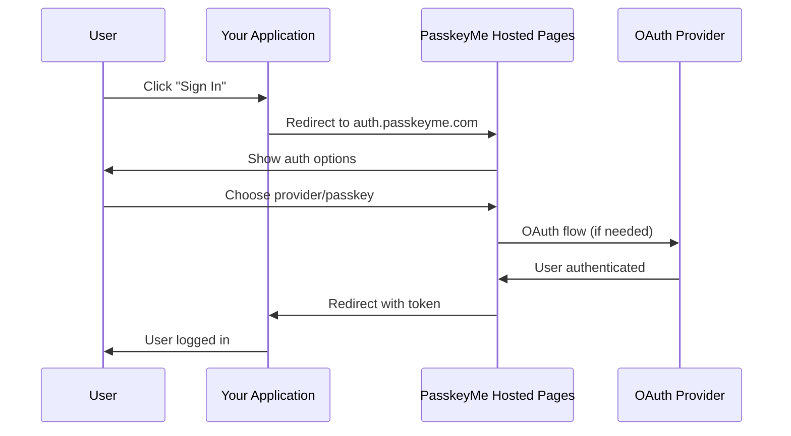

# Hosted Auth Pages 🚀

PasskeyMe's **Hosted Auth Pages** provide a complete, zero-maintenance authentication solution. We handle the UI, security, and updates while you focus on building your application.

## 🎯 **When to Use Hosted Auth**

Hosted Auth Pages are perfect for:

- **🚀 MVP Development** - Get authentication working in minutes
- **👥 Small Teams** - No need for UI/UX resources
- **🔒 Enterprise Security** - Bank-grade security without the complexity
- **📱 Cross-Platform** - Works everywhere without platform-specific code
- **🛠️ Zero Maintenance** - We handle updates, security patches, and improvements

## 🏗️ **How It Works**



## ⚡ **Quick Setup**

### 1. **Configure Your Application**

First, set up your application in the PasskeyMe console:

```javascript
// Application configuration
const appConfig = {
  appId: 'your-app-id',
  redirectUri: 'https://yourapp.com/auth/callback',
  allowedOrigins: ['https://yourapp.com'],
  oauthProviders: ['google', 'github', 'microsoft']
};
```

### 2. **Redirect to Hosted Auth**

Redirect users to our hosted authentication pages:

```javascript
function signIn(provider = null) {
  const params = new URLSearchParams({
    app_id: 'your-app-id',
    redirect_uri: 'https://yourapp.com/auth/callback'
  });

  if (provider) {
    params.append('provider', provider);
  }

  // Redirect to hosted auth
  window.location.href = `https://auth.passkeyme.com/auth?${params}`;
}

// General authentication
signIn();

// Direct provider authentication
signIn('google');
```

### 3. **Handle the Callback**

Process the authentication result in your callback handler:

```javascript
// /auth/callback handler
function handleAuthCallback() {
  const urlParams = new URLSearchParams(window.location.search);
  const token = urlParams.get('token');
  const error = urlParams.get('error');

  if (error) {
    console.error('Authentication failed:', error);
    return;
  }

  if (token) {
    // Store the token securely
    localStorage.setItem('passkeyme_token', token);
    
    // Get user information
    getUserInfo(token).then(user => {
      console.log('User authenticated:', user);
      // Redirect to dashboard or main app
      window.location.href = '/dashboard';
    });
  }
}

async function getUserInfo(token) {
  const response = await fetch(`https://api.passkeyme.com/user?token=${token}`);
  return response.json();
}
```

## 🎨 **Customization Options**

### **Branding & Styling**

Customize the hosted pages to match your brand:

```javascript
// Configure branding in PasskeyMe console
const brandingConfig = {
  // Company branding
  companyName: 'Your Company',
  logoUrl: 'https://yourapp.com/logo.png',
  
  // Color scheme
  primaryColor: '#007bff',
  backgroundColor: '#ffffff',
  textColor: '#333333',
  
  // Custom CSS
  customCss: `
    .auth-container {
      border-radius: 12px;
      box-shadow: 0 4px 20px rgba(0,0,0,0.1);
    }
  `,
  
  // Terms and privacy
  termsUrl: 'https://yourapp.com/terms',
  privacyUrl: 'https://yourapp.com/privacy'
};
```

### **Authentication Options**

Configure which authentication methods to show:

```javascript
// In your application config
const authConfig = {
  // OAuth providers
  oauthProviders: [
    'google',
    'github', 
    'microsoft',
    'apple',
    'discord'
  ],
  
  // Passkey settings
  passkeyEnabled: true,
  passkeyRequired: false, // If true, only passkeys (no OAuth)
  
  // Password authentication (if needed)
  passwordEnabled: false,
  
  // Registration settings
  registrationEnabled: true,
  emailVerificationRequired: true
};
```

## 🔗 **URL Parameters**

Control the hosted auth experience with URL parameters:

| Parameter | Description | Example |
|-----------|-------------|---------|
| `app_id` | Your application ID | `your-app-id` |
| `redirect_uri` | Where to redirect after auth | `https://yourapp.com/callback` |
| `provider` | Direct to specific provider | `google`, `github`, `microsoft` |
| `mode` | Authentication mode | `login`, `register`, `both` |
| `state` | Custom state parameter | `user_id=123&redirect=/dashboard` |
| `theme` | UI theme | `light`, `dark`, `auto` |

### **Example URLs:**

```javascript
// General authentication page
'https://auth.passkeyme.com/auth?app_id=your-app-id&redirect_uri=https://yourapp.com/callback'

// Direct Google authentication
'https://auth.passkeyme.com/auth?app_id=your-app-id&redirect_uri=https://yourapp.com/callback&provider=google'

// Registration-only mode
'https://auth.passkeyme.com/auth?app_id=your-app-id&redirect_uri=https://yourapp.com/callback&mode=register'

// With custom state
'https://auth.passkeyme.com/auth?app_id=your-app-id&redirect_uri=https://yourapp.com/callback&state=user_type=premium'
```

## 🛡️ **Security Features**

### **Built-in Security**

- **🔒 HTTPS Only** - All communications encrypted
- **🛡️ CSRF Protection** - Prevents cross-site request forgery
- **⏰ Token Expiration** - Automatic token lifecycle management
- **🔍 Domain Validation** - Only allowed origins can authenticate
- **📊 Audit Logging** - Complete authentication audit trail

### **Token Security**

```javascript
// Secure token handling
class TokenManager {
  constructor() {
    this.token = localStorage.getItem('passkeyme_token');
  }

  async getValidToken() {
    if (!this.token) return null;

    // Verify token is still valid
    const isValid = await this.verifyToken();
    if (!isValid) {
      this.clearToken();
      return null;
    }

    return this.token;
  }

  async verifyToken() {
    try {
      const response = await fetch(
        `https://api.passkeyme.com/auth/verify-token?token=${this.token}&app_id=your-app-id`
      );
      const result = await response.json();
      return result.valid;
    } catch {
      return false;
    }
  }

  clearToken() {
    this.token = null;
    localStorage.removeItem('passkeyme_token');
  }
}
```

## 📱 **Mobile Support**

Hosted Auth Pages work seamlessly on mobile devices:

### **Mobile-Optimized UI**
- 📱 **Responsive Design** - Adapts to all screen sizes
- 👆 **Touch-Friendly** - Large tap targets and smooth interactions
- ⚡ **Fast Loading** - Optimized for mobile networks
- 🔐 **Biometric Auth** - Face ID, Touch ID, fingerprint support

### **Mobile App Integration**

For mobile apps, use a web view or in-app browser:

```javascript
// React Native example
import { WebView } from 'react-native-webview';

const authUrl = `https://auth.passkeyme.com/auth?app_id=your-app-id&redirect_uri=https://yourapp.com/callback`;

<WebView
  source={{ uri: authUrl }}
  onNavigationStateChange={(navState) => {
    if (navState.url.includes('yourapp.com/callback')) {
      // Handle the callback
      handleAuthCallback(navState.url);
    }
  }}
/>
```

## 🔧 **Advanced Configuration**

### **Custom Domains**

Use your own domain for hosted auth pages:

```javascript
// Custom domain setup (Enterprise feature)
const customConfig = {
  customDomain: 'auth.yourcompany.com',
  sslCertificate: 'managed', // or 'custom'
  cname: 'auth.passkeyme.com'
};
```

### **Webhooks**

Receive real-time authentication events:

```javascript
// Webhook endpoint configuration
const webhookConfig = {
  url: 'https://yourapp.com/webhooks/passkeyme',
  events: [
    'user.authenticated',
    'user.registered',
    'user.login_failed',
    'passkey.registered'
  ],
  secret: 'your-webhook-secret'
};

// Webhook handler
app.post('/webhooks/passkeyme', (req, res) => {
  const signature = req.headers['x-passkeyme-signature'];
  const payload = req.body;
  
  // Verify webhook signature
  if (verifyWebhookSignature(payload, signature)) {
    handleAuthEvent(payload);
  }
  
  res.status(200).send('OK');
});
```

## 🎯 **Framework Examples**

### **Next.js**

```javascript
// pages/auth/callback.js
import { useRouter } from 'next/router';
import { useEffect } from 'react';

export default function AuthCallback() {
  const router = useRouter();

  useEffect(() => {
    const { token, error } = router.query;

    if (error) {
      console.error('Auth error:', error);
      router.push('/login?error=' + error);
      return;
    }

    if (token) {
      localStorage.setItem('passkeyme_token', token);
      router.push('/dashboard');
    }
  }, [router.query]);

  return <div>Processing authentication...</div>;
}
```

### **Vue.js**

```vue
<template>
  <div>
    <button @click="signIn">Sign In</button>
  </div>
</template>

<script>
export default {
  methods: {
    signIn() {
      const authUrl = `https://auth.passkeyme.com/auth?app_id=your-app-id&redirect_uri=${encodeURIComponent(window.location.origin + '/auth/callback')}`;
      window.location.href = authUrl;
    }
  },
  
  mounted() {
    // Handle callback if we're on the callback page
    if (this.$route.path === '/auth/callback') {
      const token = this.$route.query.token;
      if (token) {
        localStorage.setItem('passkeyme_token', token);
        this.$router.push('/dashboard');
      }
    }
  }
}
</script>
```

### **Angular**

```typescript
// auth.service.ts
import { Injectable } from '@angular/core';
import { Router } from '@angular/router';

@Injectable()
export class AuthService {
  constructor(private router: Router) {}

  signIn() {
    const authUrl = `https://auth.passkeyme.com/auth?app_id=your-app-id&redirect_uri=${encodeURIComponent(window.location.origin + '/auth/callback')}`;
    window.location.href = authUrl;
  }

  handleCallback() {
    const urlParams = new URLSearchParams(window.location.search);
    const token = urlParams.get('token');
    
    if (token) {
      localStorage.setItem('passkeyme_token', token);
      this.router.navigate(['/dashboard']);
    }
  }
}
```

## 📊 **Analytics & Monitoring**

Track authentication performance with built-in analytics:

### **Available Metrics**
- 📈 **Authentication Success Rate** - Track conversion rates
- ⏱️ **Authentication Time** - Monitor user experience
- 🌍 **Geographic Distribution** - See where users authenticate
- 📱 **Device & Browser Stats** - Understand your user base
- 🔐 **Authentication Methods** - Compare passkey vs OAuth usage

### **Custom Events**

Track custom events for deeper insights:

```javascript
// Track custom authentication events
function trackAuthEvent(eventName, properties) {
  fetch('https://api.passkeyme.com/analytics/track', {
    method: 'POST',
    headers: {
      'Content-Type': 'application/json',
      'Authorization': `Bearer ${token}`
    },
    body: JSON.stringify({
      event: eventName,
      properties: properties,
      timestamp: new Date().toISOString()
    })
  });
}

// Usage
trackAuthEvent('auth_started', { provider: 'google' });
trackAuthEvent('auth_completed', { method: 'passkey', duration: 1200 });
```

## 🚀 **Getting Started**

Ready to implement Hosted Auth Pages? Here's your checklist:

### **✅ Setup Checklist**

1. **Create PasskeyMe Account** - [Sign up at console.passkeyme.com](https://console.passkeyme.com)
2. **Configure Application** - Set up app ID, redirect URIs, and OAuth providers
3. **Implement Redirect** - Add sign-in button that redirects to hosted auth
4. **Handle Callback** - Process the authentication result
5. **Test Authentication** - Verify the complete flow works
6. **Customize Branding** - Add your logo and colors
7. **Go Live** - Deploy to production

### **🔧 Quick Start Code**

```html
<!DOCTYPE html>
<html>
<head>
    <title>PasskeyMe Hosted Auth Example</title>
</head>
<body>
    <button onclick="signIn()">Sign In with PasskeyMe</button>
    
    <script>
        function signIn() {
            window.location.href = 'https://auth.passkeyme.com/auth?app_id=your-app-id&redirect_uri=' + encodeURIComponent(window.location.origin + '/callback.html');
        }
        
        // Handle callback
        if (window.location.pathname === '/callback.html') {
            const params = new URLSearchParams(window.location.search);
            const token = params.get('token');
            if (token) {
                localStorage.setItem('passkeyme_token', token);
                window.location.href = '/dashboard.html';
            }
        }
    </script>
</body>
</html>
```

## 🔗 **Next Steps**

- **[API Reference](../api/overview.md)** - Explore the full API capabilities
- **[Token Management](../api/token-management.md)** - Learn about secure token handling
- **[React SDK](../sdks/react.md)** - For more control, try our React components
- **[JavaScript SDK](../sdks/javascript.md)** - Programmatic authentication control
- **[Console Guide](https://console.passkeyme.com/docs)** - Configure your application settings

---

*Hosted Auth Pages provide enterprise-grade security with zero maintenance. Perfect for teams who want to focus on their core product while we handle authentication.*
