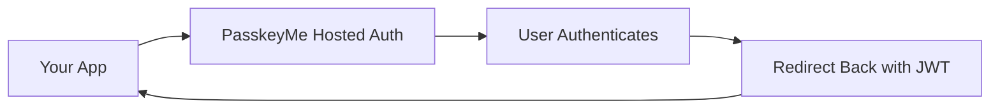

# 🚀 Quick Start Guide

Get PasskeyMe integrated into your application in under 10 minutes with our hosted authentication pages.

## Overview

PasskeyMe provides **hosted authentication pages** that work like Firebase Auth but with passkey support and enhanced security. Your users authenticate on our styled, branded pages and return to your app with secure JWT tokens.



## Step 1: Get Your App ID

1. Sign up at [PasskeyMe Dashboard](https://dashboard.passkeyme.com)
2. Create a new application
3. Copy your **App ID** from the dashboard

## Step 2: Install the SDK

Choose your preferred SDK:

import Tabs from '@theme/Tabs';
import TabItem from '@theme/TabItem';

<Tabs>
<TabItem value="javascript" label="JavaScript/TypeScript">

```bash
npm install @passkeyme/auth
```

</TabItem>
<TabItem value="react" label="React">

```bash
npm install @passkeyme/react-auth @passkeyme/auth
```

</TabItem>
</Tabs>

## Step 3: Initialize Authentication

<Tabs>
<TabItem value="javascript" label="JavaScript/TypeScript">

```typescript
import { PasskeymeAuth } from '@passkeyme/auth';

const auth = new PasskeymeAuth({
  appId: 'your-app-id', // From dashboard
  redirectUri: 'http://localhost:3000/auth/callback'
});

await auth.init();
```

</TabItem>
<TabItem value="react" label="React">

```tsx
import { PasskeymeProvider } from '@passkeyme/react-auth';

function App() {
  return (
    <PasskeymeProvider config={{
      appId: 'your-app-id',
      redirectUri: 'http://localhost:3000/auth/callback'
    }}>
      <YourApp />
    </PasskeymeProvider>
  );
}
```

</TabItem>
</Tabs>

## Step 4: Add Login Button

<Tabs>
<TabItem value="javascript" label="JavaScript/TypeScript">

```typescript
// Redirect to hosted auth page
function handleLogin() {
  auth.redirectToLogin();
}

// Add to your login button
document.getElementById('login-btn').onclick = handleLogin;
```

</TabItem>
<TabItem value="react" label="React">

```tsx
import { usePasskeyme } from '@passkeyme/react-auth';

function LoginButton() {
  const { redirectToLogin, isAuthenticated, user } = usePasskeyme();

  if (isAuthenticated) {
    return <div>Welcome, {user?.email}!</div>;
  }

  return (
    <button onClick={redirectToLogin}>
      Sign in with PasskeyMe
    </button>
  );
}
```

</TabItem>
</Tabs>

## Step 5: Handle Authentication Callback

Create a callback page to handle the return from authentication:

<Tabs>
<TabItem value="javascript" label="JavaScript/TypeScript">

```typescript
// On your /auth/callback page
async function handleCallback() {
  try {
    const user = await auth.handleAuthCallback();
    console.log('Success!', user);
    window.location.href = '/dashboard';
  } catch (error) {
    console.error('Auth failed:', error);
    window.location.href = '/login?error=auth_failed';
  }
}

handleCallback();
```

</TabItem>
<TabItem value="react" label="React">

```tsx
import { usePasskeyme } from '@passkeyme/react-auth';
import { useEffect } from 'react';
import { useNavigate } from 'react-router-dom';

function CallbackPage() {
  const { handleAuthCallback } = usePasskeyme();
  const navigate = useNavigate();

  useEffect(() => {
    handleAuthCallback()
      .then(() => navigate('/dashboard'))
      .catch(() => navigate('/login?error=auth_failed'));
  }, []);

  return <div>Processing authentication...</div>;
}
```

</TabItem>
</Tabs>

## Step 6: Protect Routes (React)

```tsx
import { usePasskeyme } from '@passkeyme/react-auth';

function ProtectedRoute({ children }) {
  const { isAuthenticated, loading } = usePasskeyme();

  if (loading) return <div>Loading...</div>;
  if (!isAuthenticated) return <div>Please log in</div>;
  
  return children;
}

// Usage
<ProtectedRoute>
  <Dashboard />
</ProtectedRoute>
```

## 🎉 That's It!

You now have:
- ✅ Secure passkey authentication
- ✅ OAuth providers (Google, GitHub, etc.)
- ✅ Username/password fallback
- ✅ Branded authentication pages
- ✅ Automatic token management

## Next Steps

- **[Configure Authentication Methods](/docs/configuration/authentication-methods)** - Enable OAuth, customize options
- **[React SDK](/docs/sdks/react)** - React-specific implementation
- **[SDK Reference](/docs/sdks/javascript)** - Explore all SDK features
- **[API Reference](/docs/api/authentication)** - Direct API usage

## Need Help?

- 📖 [Full Documentation](/docs/)
- 💬 [Community Discord](https://discord.gg/passkeyme)
- 📧 [Email Support](mailto:support@passkeyme.com)
- 🐛 [Report Issues](https://github.com/passkeyme/issues)
