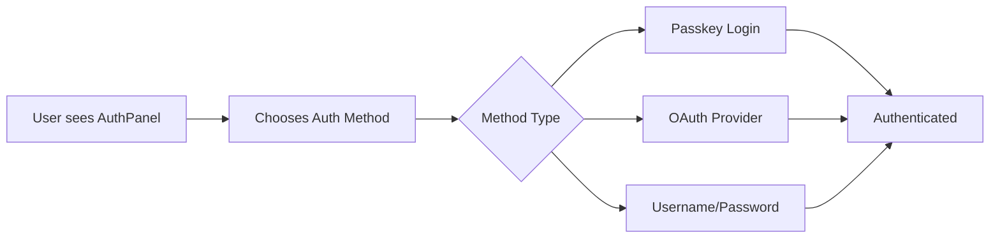

# 🚀 Quick Start Guide

Get PasskeyMe integrated into your React application in under 10 minutes with our inline authentication components.

## Choose Your Framework

import Tabs from '@theme/Tabs';
import TabItem from '@theme/TabItem';

<Tabs>
<TabItem value="react" label="⚛️ React (Recommended)" default>

**Perfect for React applications** - Get started immediately with our React SDK and PasskeymeAuthPanel component.

✅ **Available now** - Full featured React SDK  
✅ **Inline components** - No redirects, seamless UX  
✅ **Fully customizable** - Themes, layouts, styling  
✅ **TypeScript support** - Complete type definitions  

[👇 Start with React SDK](#react-quick-start)

</TabItem>
<TabItem value="javascript" label="🟨 JavaScript/Other Frameworks">

**For Vue, Angular, Svelte, or vanilla JavaScript** - Use our JavaScript SDK while we work on framework-specific SDKs.

⚡ **Available now** - Works with any framework  
🔄 **Hosted auth pages** - Simple redirect-based flow  
🛠️ **smartLogin function** - Intelligent authentication  
🚧 **Framework SDKs coming** - Angular, Vue, Svelte SDKs in development  

[👇 JavaScript SDK Guide](#javascript-quick-start)

</TabItem>
</Tabs>

---

## React Quick Start

### Overview

The PasskeymeAuthPanel provides a complete authentication solution with passkeys and OAuth providers in a single, customizable component.



### Step 1: Install the React SDK

```bash
npm install @passkeyme/react-auth @passkeyme/auth
```

### Step 2: Get Your App ID

1. Sign up at [PasskeyMe Dashboard](https://dashboard.passkeyme.com)
2. Create a new application
3. Copy your **App ID** from the dashboard
4. Configure your **redirect URIs** (e.g., `http://localhost:3000`)

### Step 3: Setup Provider

Wrap your app with the PasskeymeProvider:

```tsx
// App.tsx or _app.tsx
import { PasskeymeProvider } from '@passkeyme/react-auth';

function App() {
  return (
    <PasskeymeProvider config={{
      appId: 'your-app-id', // From dashboard
      baseUrl: 'https://api.passkeyme.com', // Optional: use custom domain
      redirectUri: window.location.origin // Your app's URL
    }}>
      <YourApp />
    </PasskeymeProvider>
  );
}

export default App;
```

### Step 4: Add Authentication Panel

Use the PasskeymeAuthPanel component for a complete auth solution:

```tsx
// LoginPage.tsx
import { PasskeymeAuthPanel } from '@passkeyme/react-auth';
import { useNavigate } from 'react-router-dom';

function LoginPage() {
  const navigate = useNavigate();

  const handleSuccess = (user: any, method: string) => {
    console.log(`Welcome ${user.email}! Logged in via ${method}`);
    navigate('/dashboard');
  };

  const handleError = (error: Error) => {
    console.error('Authentication failed:', error);
    // Show error message to user
  };

  return (
    <div style={{ 
      display: 'flex', 
      justifyContent: 'center', 
      alignItems: 'center', 
      minHeight: '100vh' 
    }}>
      <PasskeymeAuthPanel
        // OAuth Providers
        providers={['google', 'github']}
        
        // Content
        title="Welcome to MyApp"
        subtitle="Sign in to continue"
        passkeyButtonText="🚀 Sign in with Passkey"
        
        // Behavior
        enablePasskeys={true}
        autoTriggerPasskey={false}
        layout="vertical"
        
        // Event Handlers
        onSuccess={handleSuccess}
        onError={handleError}
      />
    </div>
  );
}
```

### Step 5: Protect Routes

Use the usePasskeyme hook to protect your routes:

```tsx
// ProtectedRoute.tsx
import { usePasskeyme } from '@passkeyme/react-auth';

function ProtectedRoute({ children }: { children: React.ReactNode }) {
  const { isAuthenticated, authLoading, user } = usePasskeyme(); // Fixed: authLoading instead of loading

  if (authLoading) {
    return <div>Loading...</div>;
  }

  if (!isAuthenticated) {
    return <div>Please log in to access this page.</div>;
  }

  return <>{children}</>;
}

// Dashboard.tsx
function Dashboard() {
  const { user, logout } = usePasskeyme();

  return (
    <div>
      <h1>Welcome, {user?.email}!</h1>
      <button onClick={logout}>Sign Out</button>
    </div>
  );
}

// Usage in App.tsx
<ProtectedRoute>
  <Dashboard />
</ProtectedRoute>
```

## 🎨 Customization Examples

### Theme Customization

```tsx
const darkTheme = {
  container: {
    backgroundColor: '#1f2937',
    border: '1px solid #374151',
    color: '#f9fafb',
  },
  passkeyButton: {
    backgroundColor: '#7c3aed',
    backgroundColorHover: '#6d28d9',
    color: '#ffffff',
  },
  title: {
    color: '#f9fafb',
  },
};

<PasskeymeAuthPanel
  providers={['google', 'github']}
  theme={darkTheme}
  title="Sign In"
  onSuccess={handleSuccess}
/>
```

### Layout Options

```tsx
// Horizontal layout
<PasskeymeAuthPanel
  providers={['google', 'github']}
  layout="horizontal"
  spacing="relaxed"
/>

// Grid layout for multiple providers
<PasskeymeAuthPanel
  providers={['google', 'github', 'microsoft', 'apple']}
  layout="grid"
/>
```

### Enterprise Configuration

```tsx
<PasskeymeAuthPanel
  providers={['microsoft', 'google']}
  title="Employee Portal"
  passkeyButtonText="🏢 Corporate Sign In"
  autoTriggerPasskey={true}
  hideProvidersInitially={true}
  theme={{
    container: {
      backgroundColor: '#ffffff',
      border: '2px solid #2563eb',
      fontFamily: '"Segoe UI", Tahoma, Geneva, Verdana, sans-serif',
    },
    passkeyButton: {
      backgroundColor: '#2563eb',
      fontWeight: '600',
    },
  }}
  onSuccess={handleSuccess}
/>
```

## 🔧 Advanced Features

### Debug Mode

Enable debug mode during development:

```tsx
<PasskeymeAuthPanel
  providers={['google', 'github']}
  debugMode={true}
  showDebugInfo={true}
  onSuccess={handleSuccess}
  onError={handleError}
  onPasskeyAttempt={() => console.log('Passkey attempt started')}
  onProviderSelect={(provider) => console.log(`Selected: ${provider}`)}
/>
```

### Custom Event Handling

```tsx
function LoginPage() {
  const handleProviderSelect = (provider: string) => {
    // Track analytics
    analytics.track('oauth_provider_selected', { provider });
  };

  const handlePasskeyAttempt = () => {
    // Show loading state
    setIsLoading(true);
  };

  const handleOAuthRequired = (providers: string[]) => {
    // User needs to complete OAuth registration
    console.log('OAuth registration required:', providers);
  };

  return (
    <PasskeymeAuthPanel
      providers={['google', 'github']}
      onSuccess={handleSuccess}
      onError={handleError}
      onProviderSelect={handleProviderSelect}
      onPasskeyAttempt={handlePasskeyAttempt}
      onOAuthRequired={handleOAuthRequired}
    />
  );
}
```

## 🎉 That's It!

You now have:
- ✅ **Secure passkey authentication** with biometric login
- ✅ **OAuth providers** (Google, GitHub, etc.)
- ✅ **Customizable UI** with themes and layouts
- ✅ **Complete authentication lifecycle** handling
- ✅ **TypeScript support** with full type safety

## 📚 Next Steps

- **[React SDK Reference](/docs/sdks/react)** - Explore all React SDK features
- **[Theming Guide](/docs/sdks/react#theming-and-customization)** - Advanced customization options
- **[Demo App](https://github.com/Passkeyme/passkeyme-react-demo)** - See complete implementation
- **[API Reference](https://docs.passkeyme.com/api)** - Direct API integration

---

## JavaScript Quick Start

For non-React frameworks, use our JavaScript SDK with hosted authentication pages:

### Step 1: Install JavaScript SDK

```bash
npm install @passkeyme/auth
```

### Step 2: Initialize Authentication

```typescript
import { PasskeymeAuth } from '@passkeyme/auth';

const auth = new PasskeymeAuth({
  appId: 'your-app-id',
  redirectUri: window.location.origin + '/auth/callback'
});

await auth.init();
```

### Step 3: Add Login Button

```typescript
// Redirect to hosted auth page
function handleLogin() {
  auth.redirectToLogin();
}

// Add to your login button
document.getElementById('login-btn')?.addEventListener('click', handleLogin);
```

### Step 4: Handle Authentication Callback

Create a callback page at `/auth/callback`:

```typescript
// callback.js
async function handleCallback() {
  try {
    const user = await auth.handleAuthCallback();
    console.log('Success!', user);
    window.location.href = '/dashboard';
  } catch (error) {
    console.error('Auth failed:', error);
    window.location.href = '/login?error=auth_failed';
  }
}

handleCallback();
```

### Framework Integration Examples

#### Vue.js

```vue
<template>
  <div>
    <button @click="login" v-if="!isAuthenticated">Sign In</button>
    <div v-else>Welcome, {{ user?.email }}!</div>
  </div>
</template>

<script setup>
import { ref, onMounted } from 'vue';
import { PasskeymeAuth } from '@passkeyme/auth';

const auth = new PasskeymeAuth({ appId: 'your-app-id' });
const isAuthenticated = ref(false);
const user = ref(null);

onMounted(async () => {
  await auth.init();
  isAuthenticated.value = auth.isAuthenticated();
  user.value = auth.getUser();
});

const login = () => {
  auth.redirectToLogin();
};
</script>
```

#### Angular

```typescript
// auth.service.ts
import { Injectable } from '@angular/core';
import { PasskeymeAuth } from '@passkeyme/auth';

@Injectable({ providedIn: 'root' })
export class AuthService {
  private auth = new PasskeymeAuth({
    appId: 'your-app-id'
  });

  async init() {
    await this.auth.init();
  }

  login() {
    this.auth.redirectToLogin();
  }

  isAuthenticated() {
    return this.auth.isAuthenticated();
  }
}
```

## 🔗 Resources

- **[JavaScript SDK Documentation](/docs/sdks/javascript)** - Complete API reference
- **[React SDK Documentation](/docs/sdks/react)** - React components and hooks
- **[API Documentation](https://passkeyme.com/apidocs/index.html)** - REST API reference
- **[Demo Application](https://github.com/Passkeyme/passkeyme-react-demo)** - Complete React example

## Need Help?

- 📖 [Full Documentation](/docs/)
- 💬 [Community Discord](https://discord.gg/passkeyme)
- 📧 [Email Support](mailto:support@passkeyme.com)
- 🐛 [GitHub Issues](https://github.com/passkeyme/issues)
