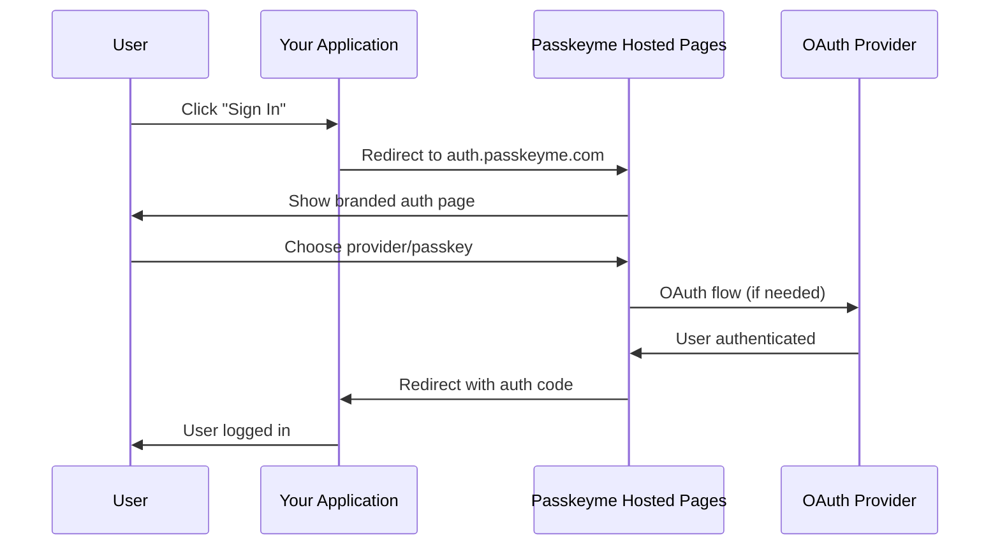

# 🌐 Hosted Authentication Pages

Passkeyme's **Hosted Authentication Pages** provide a complete, zero-maintenance authentication solution. We handle the UI, security, and updates while you focus on building your application.

:::tip Perfect for Any Framework
Hosted Auth Pages work with **any web framework** - React, Angular, Vue.js, Svelte, vanilla JavaScript, and more. No SDK integration required!
:::

## 🎯 **When to Use Hosted Auth**

Hosted Auth Pages are perfect for:

- **🚀 MVP Development** - Get authentication working in minutes
- **👥 Small Teams** - No need for UI/UX resources
- **🔒 Enterprise Security** - Bank-grade security without the complexity
- **📱 Cross-Platform** - Works everywhere without platform-specific code
- **🛠️ Zero Maintenance** - We handle updates, security patches, and improvements
- **🎨 Full Customization** - Brand the pages to match your application

## 🏗️ **How It Works**

## 📋 **Documentation Structure**

Our Hosted Auth documentation is organized into focused sections:

### **🔧 [Configuration](/docs/hosted-auth/configuration)**
Complete guide to setting up hosted authentication in the Passkeyme Admin Console:
- General authentication settings
- Branding and visual customization
- OAuth provider configuration
- Advanced security settings

### **🚀 [Implementation Guide](/docs/hosted-auth/implementation)**
Step-by-step integration instructions with code examples:
- Redirecting users to hosted auth
- Handling authentication callbacks
- Complete working examples

### **🔒 [Security & Best Practices](/docs/hosted-auth/security)**
Essential security considerations and recommendations:
- Redirect URI validation
- HTTPS requirements
- State parameter handling
- Token security

### **🎨 [Customization](/docs/hosted-auth/customization)**
Advanced branding and styling options:
- Custom CSS examples
- Logo and color configuration
- Mobile responsive designs

## 🚀 **Quick Start**

Ready to get started? Here's the basic process:

1. **[Configure](/docs/hosted-auth/configuration)** - Enable hosted auth in Admin Console
2. **[Implement](/docs/hosted-auth/implementation)** - Add redirect logic to your app
3. **[Customize](/docs/hosted-auth/customization)** - Brand the pages to match your app
4. **[Secure](/docs/hosted-auth/security)** - Follow security best practices

:::info Need Help?
Check out our [Implementation Guide](/docs/hosted-auth/implementation) for complete code examples, or review [Security Best Practices](/docs/hosted-auth/security) for production readiness.
:::

## ✨ **Key Benefits**

- **⚡ Zero Setup Time** - Authentication pages ready instantly
- **🔒 Enterprise Security** - Bank-grade security by default
- **🎨 Full Customization** - Match your brand perfectly
- **📱 Mobile Ready** - Responsive design out of the box
- **🛠️ Zero Maintenance** - We handle updates and security patches
- **🌍 Global Scale** - Built for worldwide performance
