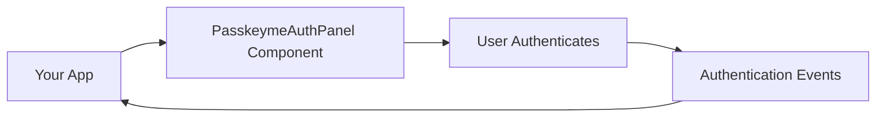

# Welcome to PasskeyMe 🔐

**PasskeyMe** is the easiest way to add modern authentication to your applications. We provide **React components for inline authentication**, JavaScript SDKs for any framework, and hosted authentication pages as an alternative - all with a developer experience similar to Firebase Auth.

## 🆕 **New React SDK - Just Released!** 

Our brand new React SDK provides the simplest way to add authentication to React applications:

```jsx
import { PasskeymeAuthPanel } from '@passkeyme/react-auth';

function LoginPage() {
  return (
    <PasskeymeAuthPanel
      providers={['google', 'github']}
      onSuccess={(user, method) => console.log('Authenticated:', user)}
      theme={{}}
    />
  );
}
```

**→ [Get Started with React SDK](./getting-started/quick-start)**

---

## 📢 **What's New?**

We're constantly improving PasskeyMe with new features and enhancements:

- 🆕 **React SDK with TypeScript** - Complete authentication components
- 🆕 **JavaScript SDK** - Framework-agnostic authentication
- 🔧 **Enhanced Hosted Auth** - Better customization and mobile support
- 🎨 **Advanced Theming** - Light, dark, and custom themes
- 📱 **Mobile Optimization** - Improved mobile authentication experience

**→ [See All New Features](./whats-new)**

---

## What is PasskeyMe?

PasskeyMe offers **inline React components** that handle the complete authentication flow directly within your application. Use our `PasskeymeAuthPanel` component for a complete auth experience, or choose hosted authentication pages for simpler integration.



## Key Features

### 🔐 **Passkeys First**
- Modern, passwordless authentication
- Biometric login (Face ID, Touch ID, Windows Hello)
- Phishing-resistant security
- Works across all devices

### 🌐 **OAuth Integration**
- Google, GitHub, Microsoft, Apple, Discord
- Server-side secret management
- No client-side OAuth complexity
- Enterprise-grade security

### 🎨 **Inline Components & Hosted Pages**
- `PasskeymeAuthPanel` React component for inline auth
- Your branding and theming
- Hosted authentication pages as alternative
- Mobile-optimized interface
- Zero maintenance required

### 🛠️ **Developer Experience**
- React components with TypeScript support
- Framework-agnostic JavaScript SDK
- Firebase Auth-like simplicity
- Copy-paste ready examples

## 🚀 **Three Ways to Integrate**

Choose the approach that fits your needs:

### 🎨 **React Components** ⭐ *New!*
Complete authentication components for React applications.

```jsx
<PasskeymeAuthPanel 
  providers={['google', 'github']}
  onSuccess={(user, method) => handleLogin(user, method)}
  theme={{}}
/>
```
**Perfect for:** React apps, custom UI, seamless user experience

### 🌐 **JavaScript SDK** ⭐ *New!*
Framework-agnostic SDK for Vue, Angular, Svelte, and vanilla JavaScript.

```javascript
const auth = new PasskeymeAuth({ appId: 'your-app-id' });
const user = await auth.signIn();
```
**Perfect for:** Non-React frameworks, custom authentication flows

### 🚀 **Hosted Auth Pages**
Zero-maintenance hosted authentication pages.

```javascript
window.location.href = 'https://auth.passkeyme.com/auth?app_id=your-app-id';
```
**Perfect for:** MVPs, simple apps, rapid development

## Quick Start

Get up and running in under 5 minutes with our new React SDK:

### **React Applications** ⭐ *Recommended*

1. **Sign up** at [console.passkeyme.com](https://console.passkeyme.com)
2. **Install React SDK** - `npm install @passkeyme/react-auth`
3. **Add component** - `<PasskeymeAuthPanel providers={['google', 'github']} />`
4. **Handle events** - `onSuccess={(user, method) => handleLogin(user, method)}`

```typescript
import { PasskeymeAuthPanel } from '@passkeyme/react-auth';

function App() {
  return (
    <PasskeymeAuthPanel
      providers={['google', 'github']}
      onSuccess={(user, method) => handleLogin(user, method)}
      theme={{}}
    />
  );
}
```

### **Other Frameworks**

```bash
npm install @passkeyme/auth
```

```javascript
const auth = new PasskeymeAuth({ appId: 'your-app-id' });
const user = await auth.signIn();
```

### **Hosted Auth (No Code)**

Just redirect to our hosted pages - no installation needed!

```javascript
window.location.href = 'https://auth.passkeyme.com/auth?app_id=your-app-id';
```

[→ Complete Quick Start Guide](/docs/getting-started/quick-start)

## Choose Your Path

### 🚀 **New to PasskeyMe?**
Start with understanding why PasskeyMe is the best choice for modern authentication:
- [Why Choose PasskeyMe?](/docs/why-passkeyme) - **See our advantages**
- [Quick Start Guide](/docs/getting-started/quick-start)
- [Installation & Setup](/docs/getting-started/installation)
- [Core Concepts](/docs/getting-started/concepts)

### 🛠️ **Ready to Integrate?**
Choose your approach and start building:
- [React SDK](/docs/sdks/react) - **Recommended for React apps**
- [JavaScript/TypeScript SDK](/docs/sdks/javascript) - For other frameworks
- [SDK Overview](/docs/sdks/overview)

### 🔧 **Configure Authentication**
Customize your authentication methods and settings:
- [Authentication Methods](/docs/configuration/authentication-methods)

### 🌐 **API Integration**
Use our REST API directly:
- [Authentication API](/docs/api/authentication)

### 🔍 **Need Help?**
Find solutions to common issues:
- [Troubleshooting](/docs/troubleshooting/common-issues)

## Why Choose PasskeyMe?

### **🚀 Faster Development**
- Ready-to-use React components for inline auth
- Hosted pages available as alternative
- Pre-built, tested, and optimized flows
- Focus on your core application features

### **🔒 Enhanced Security**
- Passkeys eliminate password-related vulnerabilities
- Server-side OAuth secret management
- Enterprise-grade compliance and monitoring

### **� Better User Experience**
- Familiar, consistent authentication across all your apps
- Biometric authentication for convenience
- Mobile-optimized interface

### **� Cost Effective**
- No infrastructure to maintain
- Predictable pricing model
- Scale from prototype to enterprise

## Authentication Methods

PasskeyMe supports multiple authentication methods:

| Method | Security | Convenience | Use Case |
|--------|----------|-------------|----------|
| **� Passkeys** | ⭐⭐⭐⭐⭐ | ⭐⭐⭐⭐⭐ | Primary authentication |
| **🌐 OAuth** | ⭐⭐⭐⭐ | ⭐⭐⭐⭐ | Social login |
| **🔑 Password** | ⭐⭐⭐ | ⭐⭐⭐ | Fallback option |

## Getting Support

- **📖 Documentation** - Comprehensive guides and API reference
- **💬 Community Discord** - Connect with other developers
- **📧 Email Support** - Direct support from our team
- **🐛 GitHub Issues** - Report bugs and request features

## Next Steps

Ready to get started? Choose your path:

1. **[Quick Start](/docs/getting-started/quick-start)** - Build your first integration
2. **[Installation Guide](/docs/getting-started/installation)** - Detailed setup instructions
3. **[SDK Overview](/docs/sdks/overview)** - Choose the right SDK for your project

---

**Welcome to the future of authentication!** 🚀
