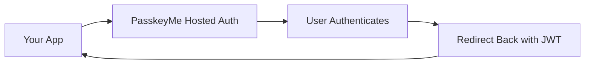

# Welcome to PasskeyMe 🔐

**PasskeyMe** is the easiest way to add modern authentication to your applications. We provide hosted authentication pages with passkey support, OAuth providers, and traditional login methods - all with a developer experience similar to Firebase Auth.

## What is PasskeyMe?

PasskeyMe offers **hosted authentication pages** that handle the complete authentication flow for your applications. Instead of building and maintaining authentication UI, you redirect users to our styled, branded pages and receive secure JWT tokens when they return.



## Key Features

### 🔐 **Passkeys First**
- Modern, passwordless authentication
- Biometric login (Face ID, Touch ID, Windows Hello)
- Phishing-resistant security
- Works across all devices

### 🌐 **OAuth Integration**
- Google, GitHub, Microsoft, Apple, Discord
- Server-side secret management
- No client-side OAuth complexity
- Enterprise-grade security

### 🎨 **Hosted Authentication Pages**
- Your branding and styling
- Mobile-optimized interface
- Multi-language support
- Zero maintenance required

### 🛠️ **Developer Experience**
- Firebase Auth-like simplicity
- Framework-agnostic JavaScript SDK
- React hooks and components
- TypeScript support

## Quick Start

Get up and running in under 10 minutes:

1. **Sign up** at [dashboard.passkeyme.com](https://dashboard.passkeyme.com)
2. **Install the SDK** - `npm install @passkeyme/auth`
3. **Add login** - `auth.redirectToLogin()`
4. **Handle callback** - `await auth.handleAuthCallback()`

```typescript
import { PasskeymeAuth } from '@passkeyme/auth';

const auth = new PasskeymeAuth({
  appId: 'your-app-id'
});

// Redirect to hosted auth page
auth.redirectToLogin();
```

[→ Complete Quick Start Guide](/docs/getting-started/quick-start)

## Choose Your Path

### 🚀 **New to PasskeyMe?**
Start with our quick start guide to build your first integration:
- [Quick Start Guide](/docs/getting-started/quick-start)
- [Installation & Setup](/docs/getting-started/installation)
- [Core Concepts](/docs/getting-started/concepts)

### 🛠️ **Ready to Integrate?**
Choose your framework and start building:
- [JavaScript/TypeScript SDK](/docs/sdks/javascript)
- [React SDK](/docs/sdks/react)
- [SDK Overview](/docs/sdks/overview)

### 🔧 **Configure Authentication**
Customize your authentication methods and settings:
- [Authentication Methods](/docs/configuration/authentication-methods)

### 🌐 **API Integration**
Use our REST API directly:
- [Authentication API](/docs/api/authentication)

### 🔍 **Need Help?**
Find solutions to common issues:
- [Troubleshooting](/docs/troubleshooting/common-issues)

## Why Choose PasskeyMe?

### **🚀 Faster Development**
- No authentication UI to build or maintain
- Pre-built, tested, and optimized flows
- Focus on your core application features

### **🔒 Enhanced Security**
- Passkeys eliminate password-related vulnerabilities
- Server-side OAuth secret management
- Enterprise-grade compliance and monitoring

### **� Better User Experience**
- Familiar, consistent authentication across all your apps
- Biometric authentication for convenience
- Mobile-optimized interface

### **� Cost Effective**
- No infrastructure to maintain
- Predictable pricing model
- Scale from prototype to enterprise

## Authentication Methods

PasskeyMe supports multiple authentication methods:

| Method | Security | Convenience | Use Case |
|--------|----------|-------------|----------|
| **� Passkeys** | ⭐⭐⭐⭐⭐ | ⭐⭐⭐⭐⭐ | Primary authentication |
| **🌐 OAuth** | ⭐⭐⭐⭐ | ⭐⭐⭐⭐ | Social login |
| **🔑 Password** | ⭐⭐⭐ | ⭐⭐⭐ | Fallback option |

## Getting Support

- **📖 Documentation** - Comprehensive guides and API reference
- **💬 Community Discord** - Connect with other developers
- **📧 Email Support** - Direct support from our team
- **🐛 GitHub Issues** - Report bugs and request features

## Next Steps

Ready to get started? Choose your path:

1. **[Quick Start](/docs/getting-started/quick-start)** - Build your first integration
2. **[Installation Guide](/docs/getting-started/installation)** - Detailed setup instructions
3. **[SDK Overview](/docs/sdks/overview)** - Choose the right SDK for your project

---

**Welcome to the future of authentication!** 🚀
