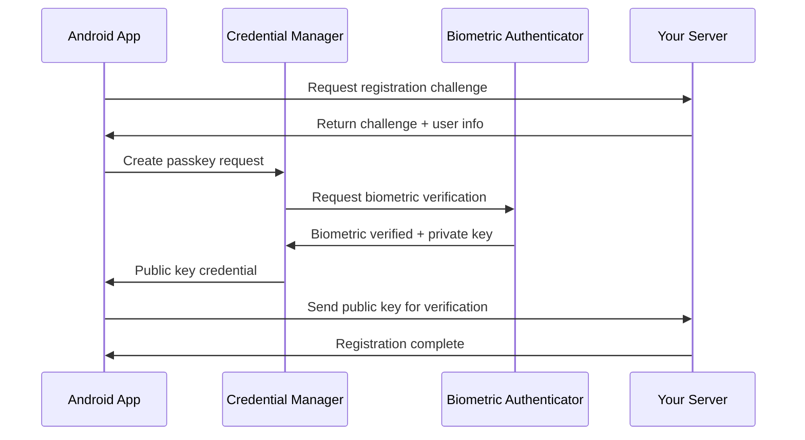

# 🤖 Android SDK

The `passkeyme-android-sdk` provides native Android passkey authentication using the AndroidX Credentials API and FIDO2 libraries. This SDK handles **only WebAuthn/FIDO2 operations** and requires backend integration for complete authentication flows.

:::info SDK Purpose
This is a **low-level SDK** for native Android apps. For React Native apps, consider:
- **[React Native SDK](/docs/getting-started/framework-comparison)** (coming Q1 2025) for React Native apps
- **[Ionic Plugin](/docs/sdks/ionic-plugin)** for Ionic/Capacitor apps
:::

## 📋 **Documentation Structure**

Our Android SDK documentation is organized into focused sections:

### **🔧 [Configuration & Setup](/docs/sdks/android/configuration)**
Complete guide to configuring your Android app for passkey authentication:
- Digital Asset Links (assetlinks.json) setup
- AndroidManifest.xml configuration
- SHA-256 certificate fingerprint generation
- Allowed Origin URL creation
- App signing configuration

### **📱 [SDK Integration](/docs/sdks/android/integration)**
Step-by-step SDK integration with code examples:
- Installation and dependencies
- Registration and authentication flows
- Jetpack Compose integration
- Traditional View integration

### **🔒 [Security & Best Practices](/docs/sdks/android/security)**
Essential security considerations for production apps:
- Secure credential storage
- Error handling patterns
- Analytics integration
- Testing strategies

### **📚 [API Reference](/docs/sdks/android/api-reference)**
Complete API documentation:
- PasskeymeSDK class methods
- Data models and enums
- Error types and handling
- Code examples

## 🚀 **Quick Start**

Ready to get started? Here's the basic process:

1. **[Configure](/docs/sdks/android/configuration)** - Set up Digital Asset Links and app configuration
2. **[Integrate](/docs/sdks/android/integration)** - Add SDK to your app with authentication flows
3. **[Secure](/docs/sdks/android/security)** - Follow security best practices for production
4. **[Reference](/docs/sdks/android/api-reference)** - Detailed API documentation for advanced usage

## ✨ **Key Features**

- **🔐 WebAuthn/FIDO2 Support** - Standards-compliant passkey authentication
- **📱 AndroidX Credentials API** - Modern Android authentication framework
- **🛡️ Biometric Integration** - Secure biometric authentication
- **🎨 Jetpack Compose Ready** - Modern UI toolkit support
- **🔧 Flexible Integration** - Works with existing authentication systems
- **📊 Analytics Ready** - Built-in event tracking support

## 📋 **Prerequisites Checklist**

Before implementing Android passkeys, ensure you have:

- [ ] **Android API 28+** - Minimum required Android version
- [ ] **HTTPS Domain** - Required for Digital Asset Links
- [ ] **App Signing Key** - For SHA-256 fingerprint generation
- [ ] **Backend Integration** - Server-side passkey verification
- [ ] **PasskeyMe Account** - Application ID and configuration

:::warning Important Setup Requirements
Android passkeys require proper **Digital Asset Links** configuration and **app signing** setup. Without these, passkey authentication will fail. Follow our [Configuration Guide](/docs/sdks/android/configuration) carefully.
:::

## 🏗️ **How Android Passkeys Work**



## 🔗 **Related Documentation**

- **[PasskeyMe Overview](/docs/getting-started/concepts)** - Understanding PasskeyMe platform
- **[Getting Started](/docs/getting-started/quick-start)** - Platform setup guide
- **[Hosted Auth Pages](/docs/getting-started/hosted-auth)** - Alternative no-code solution
- **[API Documentation](/docs/api/api-overview)** - Server-side integration

:::tip Need Help?
- Check out our [Configuration Guide](/docs/sdks/android/configuration) for detailed setup instructions
- Review [Integration Examples](/docs/sdks/android/integration) for code samples
- Follow [Security Best Practices](/docs/sdks/android/security) for production readiness
:::

## 📱 **Example Implementation**

Here's a quick preview of what Android passkey integration looks like:

```kotlin
class AuthenticationManager(private val context: Context) {
    private val passkeymeSDK = PasskeymeSDK(context, debug = true)
    
    suspend fun registerPasskey(username: String, displayName: String) {
        try {
            // Get challenge from your backend
            val challenge = getRegistrationChallenge(username)
            
            // Perform passkey registration
            val result = passkeymeSDK.register(
                username = username,
                displayName = displayName,
                challenge = challenge.challenge,
                rp = challenge.rp,
                user = challenge.user,
                pubKeyCredParams = challenge.pubKeyCredParams
            )
            
            if (result.success) {
                // Complete registration with backend
                completeRegistration(result.credential!!, username)
            }
        } catch (e: Exception) {
            // Handle registration error
            handleError(e)
        }
    }
}
```

Ready to implement Android passkeys? Start with our [Configuration Guide](/docs/sdks/android/configuration) to set up your app properly!
