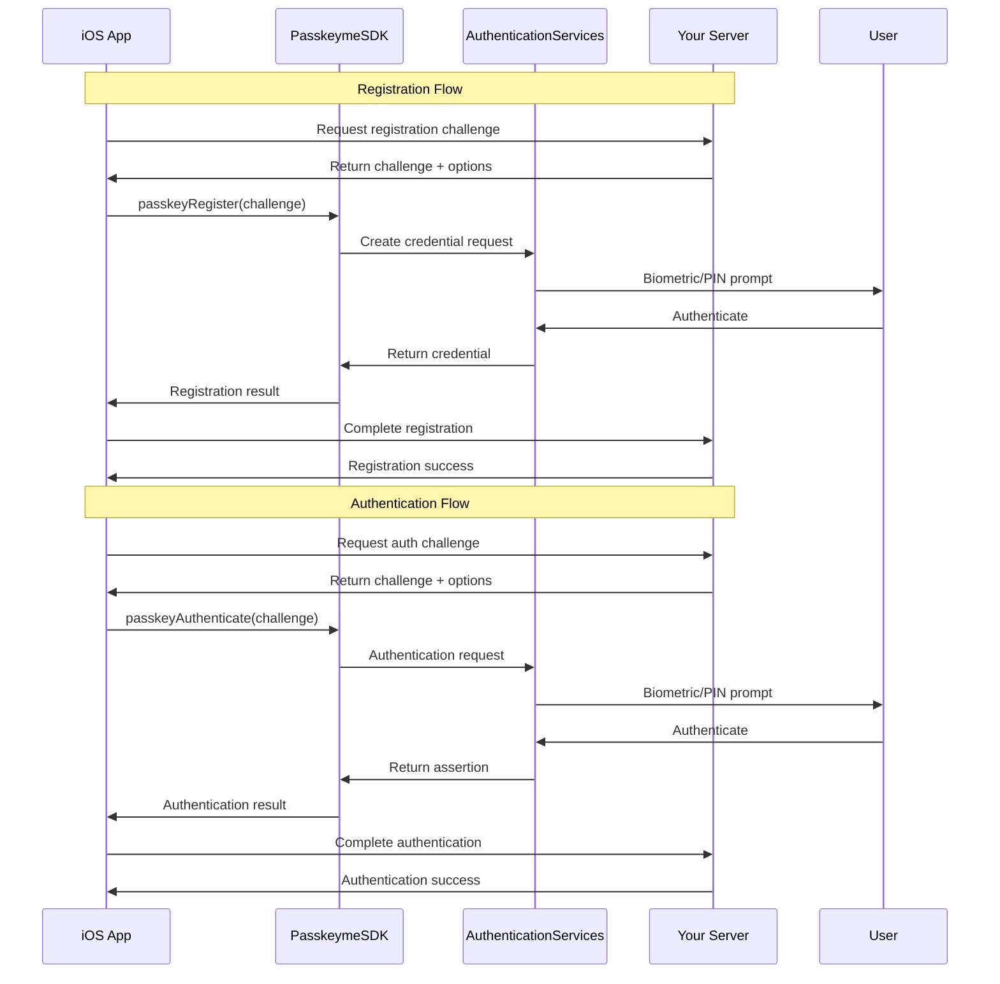

# 📱 **iOS SDK**

The `PasskeymeSDK` provides native iOS passkey authentication using the AuthenticationServices framework. This SDK handles **only WebAuthn/FIDO2 operations** and requires backend integration for complete authentication flows.

## **🚀 Quick Start**

Get started with iOS passkey authentication in just a few steps:

1. **[Configuration & Setup](/docs/sdks/ios/configuration)** - Configure apple-app-site-association and Associated Domains
2. **[SDK Integration](/docs/sdks/ios/integration)** - Install and integrate the SDK into your iOS app
3. **[Security Best Practices](/docs/sdks/ios/security)** - Implement production security patterns
4. **[API Reference](/docs/sdks/ios/api-reference)** - Complete SDK documentation

## **📋 Prerequisites**

- **iOS 16.0+** (for optimal passkey support)
- **Xcode 14+** with Swift 5.7+
- **Apple Developer Account** with app signing capabilities
- **Domain ownership** for apple-app-site-association hosting
- **PasskeyMe Application** configured at [passkeyme.com](https://passkeyme.com)

## **⚙️ How It Works**



## **🔧 Installation**

### **CocoaPods**
```ruby
# Podfile
pod 'PasskeymeSDK'
```

### **Swift Package Manager**
```swift
dependencies: [
    .package(url: "https://github.com/passkeyme/ios-sdk.git", from: "1.0.0")
]
```

## **💡 Quick Example**

```swift
import PasskeymeSDK

class AuthManager {
    func registerPasskey(challenge: String) {
        PasskeymeSDK.passkeyRegister(challenge: challenge) { result in
            switch result {
            case .success(let credential):
                print("Registration successful: \(credential)")
            case .failure(let error):
                print("Registration failed: \(error.localizedDescription)")
            }
        }
    }
    
    func authenticatePasskey(challenge: String) {
        PasskeymeSDK.passkeyAuthenticate(challenge: challenge) { result in
            switch result {
            case .success(let assertion):
                print("Authentication successful: \(assertion)")
            case .failure(let error):
                print("Authentication failed: \(error.localizedDescription)")
            }
        }
    }
}
```

## **📚 Documentation Structure**

<div style={{display: 'grid', gridTemplateColumns: 'repeat(auto-fit, minmax(250px, 1fr))', gap: '1rem', marginTop: '2rem'}}>

<div style={{border: '1px solid var(--ifm-color-emphasis-300)', borderRadius: '8px', padding: '1rem'}}>
  <h3>🔧 Configuration</h3>
  <p>Essential setup including apple-app-site-association and Associated Domains</p>
  <a href="/docs/sdks/ios/configuration" className="button button--primary">Setup Guide →</a>
</div>

<div style={{border: '1px solid var(--ifm-color-emphasis-300)', borderRadius: '8px', padding: '1rem'}}>
  <h3>📱 Integration</h3>
  <p>Complete SDK integration with SwiftUI and UIKit examples</p>
  <a href="/docs/sdks/ios/integration" className="button button--primary">Integration →</a>
</div>

<div style={{border: '1px solid var(--ifm-color-emphasis-300)', borderRadius: '8px', padding: '1rem'}}>
  <h3>🔒 Security</h3>
  <p>Production security best practices and implementation patterns</p>
  <a href="/docs/sdks/ios/security" className="button button--primary">Security →</a>
</div>

<div style={{border: '1px solid var(--ifm-color-emphasis-300)', borderRadius: '8px', padding: '1rem'}}>
  <h3>📖 API Reference</h3>
  <p>Complete SDK API documentation with examples and data structures</p>
  <a href="/docs/sdks/ios/api-reference" className="button button--primary">API Docs →</a>
</div>

</div>

## **🔗 Related Documentation**

- **[PasskeyMe Overview](/docs/getting-started/concepts)** - Understanding PasskeyMe platform
- **[Getting Started](/docs/getting-started/quick-start)** - Platform setup guide
- **[Hosted Auth Pages](/docs/getting-started/hosted-auth)** - Alternative no-code solution
- **[API Documentation](/docs/api/api-overview)** - Server-side integration

:::tip Need Help?
The iOS SDK provides comprehensive support for passkey authentication. If you need assistance with integration or have questions about specific use cases, check our [troubleshooting guide](/docs/troubleshooting/common-issues) or reach out to our support team.
:::

:::info SDK Purpose
This is a **low-level SDK** for native iOS apps. For cross-platform solutions, consider:
- **[React Native SDK](/docs/getting-started/framework-comparison)** (coming Q1 2025) for React Native apps
- **[JavaScript SDK](/docs/sdks/javascript)** for web-based apps within iOS WebViews
:::
