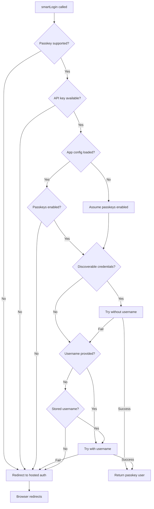

# 🧠 smartLogin Method

The `smartLogin` method provides **intelligent passkey authentication** that automatically detects device capabilities and falls back gracefully to hosted authentication when needed. This is the **recommended authentication method** for most applications.

## ✨ **Why smartLogin?**

- **🧠 Intelligent Detection** - Automatically detects passkey support and capabilities
- **🔄 Graceful Fallbacks** - Falls back to hosted auth when passkeys aren't available
- **🚀 Best Performance** - Uses fastest available authentication method
- **📱 Cross-Platform** - Works consistently across all devices and browsers
- **⚡ Zero Configuration** - Works out of the box with smart defaults
- **🛡️ Security First** - Always attempts most secure method first

## 📋 **Method Signature**

```typescript
async smartLogin(
  username?: string,
  apiKey?: string
): Promise<{ method: "passkey" | "redirect"; user?: User }>
```

### **Parameters**

| Parameter | Type | Required | Description |
|-----------|------|----------|-------------|
| `username` | `string` | ❌ | Username hint for targeted passkey authentication |
| `apiKey` | `string` | ❌ | Passkey API key (uses configured key if not provided) |

### **Return Value**

```typescript
{
  method: "passkey" | "redirect";  // Authentication method used
  user?: User;                     // User object (if passkey successful)
}
```

- **`method: "passkey"`** - Passkey authentication succeeded, user is authenticated
- **`method: "redirect"`** - Redirected to hosted auth page (browser will navigate)

## 🚀 **Basic Usage**

### **Simple Smart Login**

```typescript
import { PasskeymeAuth } from '@passkeyme/auth';

const auth = new PasskeymeAuth({
  appId: 'your-app-id',
  redirectUri: 'https://yourapp.com/auth/callback'
});

await auth.init();

// Intelligent authentication with automatic fallbacks
try {
  const result = await auth.smartLogin();
  
  if (result.method === 'passkey') {
    console.log('✅ Passkey authentication successful!', result.user);
    // User is authenticated, proceed to app
    redirectToApp(result.user);
  } else {
    console.log('🌐 Redirecting to hosted auth page...');
    // Browser will redirect to hosted auth page
    // User will return via callback
  }
} catch (error) {
  console.error('❌ Authentication failed:', error);
}
```

### **Smart Login with Username Hint**

```typescript
// Provide username for more targeted authentication
const result = await auth.smartLogin('user@example.com');

if (result.method === 'passkey') {
  console.log('User authenticated via passkey:', result.user);
} else {
  console.log('Fallback to hosted auth with username context');
}
```

### **Smart Login with Custom API Key**

```typescript
// Use specific API key for passkey authentication
const result = await auth.smartLogin(
  'user@example.com',
  'your-custom-passkey-api-key'
);
```

## 🔄 **Authentication Flow**

### **Smart Login Decision Tree**



### **Authentication Steps**

1. **🔍 Environment Check** - Verify passkey support and browser capabilities
2. **⚙️ Configuration Load** - Load app configuration and passkey settings
3. **🔐 Passkey Attempt** - Try passkey authentication with smart username resolution
4. **🌐 Fallback Redirect** - Redirect to hosted auth if passkey fails or unavailable

## 🎯 **Usage Patterns**

### **Login Page Integration**

```typescript
// login.ts
class LoginPage {
  private auth: PasskeymeAuth;

  constructor() {
    this.auth = new PasskeymeAuth({
      appId: 'your-app-id',
      redirectUri: window.location.origin + '/auth/callback',
      debug: process.env.NODE_ENV === 'development'
    });
  }

  async initialize() {
    await this.auth.init();
    
    // Check if user is already authenticated
    const currentUser = this.auth.getCurrentUser();
    if (currentUser) {
      this.redirectToApp(currentUser);
      return;
    }

    this.setupLoginButton();
  }

  private setupLoginButton() {
    const loginButton = document.getElementById('login-btn');
    
    loginButton?.addEventListener('click', async () => {
      this.setLoading(true);
      
      try {
        const result = await this.auth.smartLogin();
        
        if (result.method === 'passkey') {
          console.log('Passkey login successful!');
          this.redirectToApp(result.user!);
        }
        // If method === 'redirect', browser will navigate to hosted auth
      } catch (error) {
        this.showError('Authentication failed. Please try again.');
        console.error('Login error:', error);
      } finally {
        this.setLoading(false);
      }
    });
  }

  private setLoading(loading: boolean) {
    const button = document.getElementById('login-btn') as HTMLButtonElement;
    if (button) {
      button.disabled = loading;
      button.textContent = loading ? 'Authenticating...' : 'Sign In';
    }
  }

  private redirectToApp(user: User) {
    window.location.href = '/dashboard';
  }
}

// Initialize when page loads
document.addEventListener('DOMContentLoaded', () => {
  new LoginPage().initialize();
});
```

### **SPA Router Integration**

```typescript
// Vue.js example
export default {
  async mounted() {
    this.auth = new PasskeymeAuth({
      appId: 'your-app-id',
      redirectUri: window.location.origin + '/auth/callback'
    });
    
    await this.auth.init();
    
    // Auto-login attempt if not authenticated
    if (!this.auth.getCurrentUser()) {
      await this.tryAutoLogin();
    }
  },

  methods: {
    async tryAutoLogin() {
      try {
        const result = await this.auth.smartLogin();
        
        if (result.method === 'passkey') {
          this.$store.commit('setUser', result.user);
          this.$router.push('/dashboard');
        }
        // Redirect case handled automatically
      } catch (error) {
        console.log('Auto-login not available, showing login page');
      }
    },

    async handleLoginClick() {
      this.loading = true;
      
      try {
        const result = await this.auth.smartLogin(this.email);
        
        if (result.method === 'passkey') {
          this.$store.commit('setUser', result.user);
          this.$router.push('/dashboard');
        }
      } catch (error) {
        this.error = 'Authentication failed. Please try again.';
      } finally {
        this.loading = false;
      }
    }
  }
}
```

### **Progressive Enhancement**

```typescript
// Enhanced login with progressive features
class EnhancedAuth {
  private auth: PasskeymeAuth;
  private lastUsername: string | null = null;

  constructor() {
    this.auth = new PasskeymeAuth({
      appId: 'your-app-id',
      redirectUri: window.location.origin + '/auth/callback',
      debug: true
    });
    
    this.loadLastUsername();
  }

  async performSmartLogin(username?: string) {
    const authUsername = username || this.lastUsername || undefined;
    
    try {
      const result = await this.auth.smartLogin(authUsername);
      
      if (result.method === 'passkey') {
        // Store username for future use
        if (result.user?.email) {
          this.storeLastUsername(result.user.email);
        }
        
        return result.user;
      }
      
      // Browser will redirect for hosted auth
      return null;
    } catch (error) {
      console.error('Smart login failed:', error);
      throw error;
    }
  }

  private loadLastUsername() {
    this.lastUsername = localStorage.getItem(`last_username_${this.auth.config.appId}`);
  }

  private storeLastUsername(username: string) {
    this.lastUsername = username;
    localStorage.setItem(`last_username_${this.auth.config.appId}`, username);
  }
}
```

## ⚙️ **Advanced Configuration**

### **Custom Passkey API Key**

```typescript
// Different API keys for different environments
const getPasskeyApiKey = () => {
  switch (process.env.NODE_ENV) {
    case 'development':
      return 'dev-passkey-api-key';
    case 'staging':
      return 'staging-passkey-api-key';
    case 'production':
      return 'prod-passkey-api-key';
    default:
      return undefined;
  }
};

const result = await auth.smartLogin(
  'user@example.com',
  getPasskeyApiKey()
);
```

### **Smart Login with Context**

```typescript
// Contextual authentication based on user journey
class ContextualAuth {
  async smartLoginWithContext(context: 'signup' | 'login' | 'checkout') {
    let username: string | undefined;
    
    // Pre-populate username based on context
    switch (context) {
      case 'signup':
        username = this.getSignupEmail();
        break;
      case 'login':
        username = this.getStoredUsername();
        break;
      case 'checkout':
        username = this.getCheckoutEmail();
        break;
    }

    const result = await this.auth.smartLogin(username);
    
    if (result.method === 'passkey') {
      this.trackAnalytics(`${context}_passkey_success`);
      return result.user;
    } else {
      this.trackAnalytics(`${context}_hosted_redirect`);
      return null;
    }
  }
}
```

## 🧪 **Error Handling**

### **Comprehensive Error Handling**

```typescript
import { PasskeymeError, PasskeymeErrorCode } from '@passkeyme/auth';

async function robustSmartLogin(auth: PasskeymeAuth, username?: string) {
  try {
    const result = await auth.smartLogin(username);
    
    if (result.method === 'passkey') {
      console.log('✅ Passkey authentication successful');
      return result.user;
    } else {
      console.log('🌐 Redirecting to hosted authentication');
      return null;
    }
  } catch (error) {
    if (error instanceof PasskeymeError) {
      switch (error.code) {
        case PasskeymeErrorCode.PASSKEY_NOT_SUPPORTED:
          console.log('Passkeys not supported, using hosted auth');
          auth.redirectToLogin();
          break;
          
        case PasskeymeErrorCode.USER_CANCELLED:
          console.log('User cancelled authentication');
          // Don't show error, just remain on login page
          break;
          
        case PasskeymeErrorCode.NETWORK_ERROR:
          console.error('Network error during authentication');
          showError('Network error. Please check your connection and try again.');
          break;
          
        default:
          console.error('Authentication error:', error.message);
          showError('Authentication failed. Please try again.');
      }
    } else {
      console.error('Unexpected error:', error);
      showError('An unexpected error occurred.');
    }
    
    return null;
  }
}
```

### **Retry Logic**

```typescript
async function smartLoginWithRetry(
  auth: PasskeymeAuth, 
  username?: string, 
  maxRetries: number = 2
) {
  for (let attempt = 1; attempt <= maxRetries; attempt++) {
    try {
      const result = await auth.smartLogin(username);
      return result; // Success
    } catch (error) {
      if (error instanceof PasskeymeError) {
        // Don't retry certain error types
        if (error.code === PasskeymeErrorCode.USER_CANCELLED ||
            error.code === PasskeymeErrorCode.PASSKEY_NOT_SUPPORTED) {
          throw error;
        }
        
        // Retry on network errors and other recoverable errors
        if (attempt < maxRetries && error.retryable) {
          console.log(`Retry attempt ${attempt + 1}/${maxRetries}`);
          await new Promise(resolve => setTimeout(resolve, 1000 * attempt));
          continue;
        }
      }
      
      throw error; // Max retries reached or non-retryable error
    }
  }
}
```

## 📊 **Analytics & Monitoring**

### **Authentication Analytics**

```typescript
class AuthAnalytics {
  async trackSmartLogin(auth: PasskeymeAuth, username?: string) {
    const startTime = Date.now();
    
    try {
      const result = await auth.smartLogin(username);
      const duration = Date.now() - startTime;
      
      // Track successful authentication
      analytics.track('auth_smart_login_success', {
        method: result.method,
        duration,
        had_username: !!username,
        user_id: result.user?.id
      });
      
      return result;
    } catch (error) {
      const duration = Date.now() - startTime;
      
      // Track failed authentication
      analytics.track('auth_smart_login_error', {
        error_code: error instanceof PasskeymeError ? error.code : 'unknown',
        duration,
        had_username: !!username
      });
      
      throw error;
    }
  }
}
```

## 🔗 **Related Methods**

- **[redirectToLogin](./redirect-to-login.md)** - Direct redirect to hosted auth pages
- **[handleAuthCallback](./handle-auth-callback.md)** - Handle return from OAuth flow
- **[Advanced Usage](./advanced-usage.md)** - Complex authentication scenarios

## 📚 **Next Steps**

- **[Authentication Callback Handling](./handle-auth-callback.md)** - Handle successful returns
- **[Framework Integration Examples](../javascript.md#framework-examples)** - Vue, Angular, Svelte
- **[Error Handling Guide](../javascript.md#error-handling)** - Comprehensive error management

---

*smartLogin provides the most intelligent and user-friendly authentication experience. Use it as your primary authentication method for the best user experience.*
