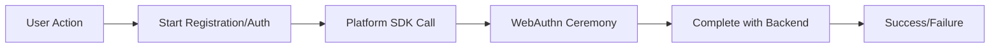

# 🔧 Low-Level SDKs Overview

Low-level SDKs provide direct passkey ceremony implementations for specific platforms. These SDKs handle **only WebAuthn/FIDO2 passkey operations** and do not include OAuth integration or hosted authentication pages.

:::info When to Use Low-Level SDKs
- **Custom authentication flows** requiring fine-grained control
- **Platform-specific integrations** (native iOS/Android apps)
- **Passkey-only implementations** without OAuth or hosted pages
- **Advanced use cases** where high-level SDKs don't meet requirements
:::

## 🎯 SDK Selection Guide

### **High-Level SDKs (Recommended)**
For most developers, start with these comprehensive SDKs:

| Framework | SDK | Features |
|-----------|-----|----------|
| **React** | [`@passkeyme/react-auth`](/docs/sdks/react) | ✅ Inline components<br/>✅ OAuth integration<br/>✅ Hosted pages<br/>✅ Complete auth lifecycle |
| **Other Frameworks** | [`@passkeyme/auth`](/docs/sdks/javascript) | ✅ Smart login<br/>✅ OAuth integration<br/>✅ Hosted pages<br/>✅ Framework agnostic |

### **Low-Level SDKs (Advanced)**
Use these for platform-specific or custom implementations:

| Platform | SDK | Use Cases |
|----------|-----|-----------|
| **Web Browsers** | [`passkeyme-web-sdk`](/docs/sdks/web-sdk) | Custom web auth flows |
| **iOS Native** | [`PasskeymeSDK`](/docs/sdks/ios/) | Swift/Objective-C apps |
| **Android Native** | [`passkeyme-android-sdk`](/docs/sdks/android-sdk) | Kotlin/Java apps |
| **Ionic/Capacitor** | [`passkeyme-ionic-cap-plugin`](/docs/sdks/ionic-plugin) | Cross-platform mobile |

## 🔄 Integration Patterns

### **Passkey-Only Flow**


### **Backend Integration Required**
All low-level SDKs require your backend to:

1. **Call PasskeyMe API** to start registration/authentication
2. **Receive challenge** from PasskeyMe
3. **Pass challenge** to platform SDK
4. **Receive credential** from platform SDK
5. **Complete ceremony** with PasskeyMe API

```typescript
// Typical backend integration pattern
const challenge = await passkeymeAPI.startRegistration(username);
const credential = await platformSDK.register(challenge);
const result = await passkeymeAPI.completeRegistration(credential);
```

## 🛡️ Security Considerations

### **API Key Management**
Low-level SDKs require PasskeyMe API keys:

```typescript
// ✅ Secure - API key on backend only
const challenge = await backend.startPasskeyAuth(); // Backend calls PasskeyMe
const credential = await platformSDK.authenticate(challenge);
const result = await backend.completePasskeyAuth(credential);

// ❌ Insecure - Never expose API keys in client code
const sdk = new PlatformSDK({ apiKey: 'exposed-key' }); // Don't do this!
```

### **Challenge Validation**
Always validate challenges come from your trusted backend:

```typescript
// ✅ Validate challenge origin
if (!challenge.origin || challenge.origin !== 'your-backend.com') {
  throw new Error('Invalid challenge origin');
}

// ✅ Verify challenge is recent (within 5 minutes)
if (Date.now() - challenge.timestamp > 300000) {
  throw new Error('Challenge expired');
}
```

## 📚 Platform-Specific Guides

### **Web Applications**
- **[Web SDK](/docs/sdks/web-sdk)** - Browser-based passkey ceremonies
- Best for: Custom authentication UIs, progressive web apps

### **iOS Applications**
- **[iOS SDK](/docs/sdks/ios/)** - Native iOS passkey implementation
- Best for: Swift/Objective-C apps, iOS-specific features

### **Android Applications**
- **[Android SDK](/docs/sdks/android-sdk)** - Native Android passkey implementation  
- Best for: Kotlin/Java apps, Android-specific features

### **Cross-Platform Mobile**
- **[Ionic Plugin](/docs/sdks/ionic-plugin)** - Capacitor-based passkey support
- Best for: Ionic/Angular apps, cross-platform development

## 🔗 Migration Paths

### **From High-Level to Low-Level**
If you need more control than high-level SDKs provide:

1. **Keep existing OAuth flows** using high-level SDKs
2. **Replace passkey flows** with low-level SDK implementation
3. **Maintain backend integration** for non-passkey methods

### **From Low-Level to High-Level**
If you want simpler integration:

1. **Replace platform SDK calls** with high-level SDK methods
2. **Add OAuth integration** using high-level SDK features
3. **Simplify backend** by removing custom passkey ceremony handling

## ⚡ Quick Start by Platform

Choose your platform to get started:

<div className="button-grid">
  <a href="/docs/sdks/web-sdk" className="button button--primary">
    🌐 Web SDK
  </a>
  <a href="/docs/sdks/ios/" className="button button--primary">
    📱 iOS SDK
  </a>
  <a href="/docs/sdks/android-sdk" className="button button--primary">
    🤖 Android SDK
  </a>
  <a href="/docs/sdks/ionic-plugin" className="button button--primary">
    ⚡ Ionic Plugin
  </a>
</div>

---

:::tip Need Help Choosing?
- **Most developers**: Start with [React SDK](/docs/sdks/react) or [JavaScript SDK](/docs/sdks/javascript)
- **Custom requirements**: Use low-level SDKs with backend integration
- **Questions?** Check our [FAQ](/docs/faq) or [contact support](https://passkeyme.com/support)
:::
