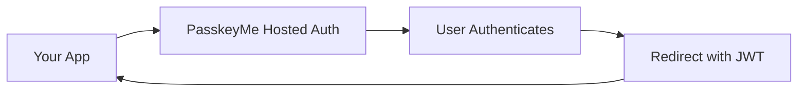

# 🛠️ SDK Overview

PasskeyMe provides modern, framework-specific SDKs that make authentication integration simple and secure. All SDKs are built around **hosted authentication pages** for the best developer and user experience.

## 🎯 Hosted Authentication Approach

Our SDKs redirect users to PasskeyMe's hosted authentication pages, similar to how OAuth providers work. This approach provides:

- **🎨 Centralized branding** - Your logo and styling across all apps
- **🔒 Enhanced security** - OAuth secrets never exposed to clients
- **🚀 Zero maintenance** - We handle UI updates and security patches
- **📱 Mobile optimized** - Perfect experience on all devices
- **🌍 Multi-language support** - Localized authentication pages



## 📚 Available SDKs

### 🟨 JavaScript/TypeScript SDK

**`@passkeyme/auth`** - Core SDK for all JavaScript applications

```bash
npm install @passkeyme/auth
```

**Perfect for:**
- Vanilla JavaScript/TypeScript projects
- Vue.js, Angular, Svelte applications
- Next.js, Vite, Webpack projects
- Any modern web framework

**Key features:**
- Framework-agnostic design
- TypeScript support with full type definitions
- Automatic token management and refresh
- Event-driven authentication state
- Comprehensive error handling

**Quick example:**
```typescript
import { PasskeymeAuth } from '@passkeyme/auth';

const auth = new PasskeymeAuth({
  appId: 'your-app-id'
});

// Redirect to hosted auth
auth.redirectToLogin();
```

[→ JavaScript SDK Documentation](/docs/sdks/javascript)

### ⚛️ React SDK

**`@passkeyme/react-auth`** - React hooks and components

```bash
npm install @passkeyme/react-auth @passkeyme/auth
```

**Perfect for:**
- React applications (Create React App, Vite)
- Next.js (App Router and Pages Router)
- React Native web applications
- Any React-based framework

**Key features:**
- `usePasskeyme` hook for authentication state
- Provider component for app-wide auth context
- React Suspense support
- SSR/SSG compatibility
- TypeScript support

**Quick example:**
```tsx
import { usePasskeyme } from '@passkeyme/react-auth';

function LoginButton() {
  const { redirectToLogin, isAuthenticated, user } = usePasskeyme();
  
  return isAuthenticated ? (
    <div>Welcome, {user.email}!</div>
  ) : (
    <button onClick={redirectToLogin}>Sign In</button>
  );
}
```

[→ React SDK Documentation](/docs/sdks/react)

### 📱 Mobile SDKs (Coming Soon)

**iOS Swift SDK** - Native iOS integration
- SwiftUI and UIKit support
- Keychain integration
- Universal Links support

**Android Kotlin SDK** - Native Android integration  
- Jetpack Compose support
- Android Keystore integration
- Deep link handling

**React Native SDK** - Cross-platform mobile
- Expo and bare React Native support
- Biometric authentication
- Seamless web integration

## 🔄 Authentication Flow

All SDKs follow the same secure authentication pattern:

1. **Initiate Login** - User clicks login in your app
2. **Redirect to PasskeyMe** - SDK redirects to hosted auth page
3. **User Authenticates** - User completes authentication (passkeys, OAuth, password)
4. **Return with Tokens** - User redirected back with secure JWT tokens
5. **Authenticated State** - SDK manages tokens and provides user state

## 🚀 Choose Your SDK

### For JavaScript/TypeScript Projects

```typescript
// All frameworks (Vue, Angular, Svelte, etc.)
import { PasskeymeAuth } from '@passkeyme/auth';

const auth = new PasskeymeAuth({
  appId: 'your-app-id',
  redirectUri: window.location.origin + '/auth/callback'
});
```

### For React Projects

```tsx
// React-specific hooks and components
import { PasskeymeProvider, usePasskeyme } from '@passkeyme/react-auth';

function App() {
  return (
    <PasskeymeProvider config={{ appId: 'your-app-id' }}>
      <YourApp />
    </PasskeymeProvider>
  );
}
```

### For Mobile Projects

```typescript
// Coming soon - React Native
import { PasskeymeAuth } from '@passkeyme/react-native';

// Coming soon - iOS Swift
import PasskeymeAuth

// Coming soon - Android Kotlin
import com.passkeyme.auth.PasskeymeAuth
```

## 🔧 Framework-Specific Guides

### Next.js Integration

**App Router:**
```tsx
// app/providers.tsx
'use client';
import { PasskeymeProvider } from '@passkeyme/react-auth';

export function Providers({ children }) {
  return (
    <PasskeymeProvider config={{ appId: process.env.NEXT_PUBLIC_PASSKEYME_APP_ID! }}>
      {children}
    </PasskeymeProvider>
  );
}
```

**Pages Router:**
```tsx
// pages/_app.tsx
import { PasskeymeProvider } from '@passkeyme/react-auth';

export default function App({ Component, pageProps }) {
  return (
    <PasskeymeProvider config={{ appId: process.env.NEXT_PUBLIC_PASSKEYME_APP_ID! }}>
      <Component {...pageProps} />
    </PasskeymeProvider>
  );
}
```

### Vue.js Integration

```typescript
// composables/useAuth.ts
import { ref } from 'vue';
import { PasskeymeAuth } from '@passkeyme/auth';

const auth = new PasskeymeAuth({
  appId: import.meta.env.VITE_PASSKEYME_APP_ID
});

export function useAuth() {
  const user = ref(null);
  const isAuthenticated = ref(false);
  
  return {
    user,
    isAuthenticated,
    login: () => auth.redirectToLogin(),
    logout: () => auth.logout()
  };
}
```

### Angular Integration

```typescript
// auth.service.ts
import { Injectable } from '@angular/core';
import { PasskeymeAuth } from '@passkeyme/auth';

@Injectable({ providedIn: 'root' })
export class AuthService {
  private auth = new PasskeymeAuth({
    appId: environment.passkeymeAppId
  });

  login() {
    this.auth.redirectToLogin();
  }

  async logout() {
    await this.auth.logout();
  }
}
```

### Svelte Integration

```typescript
// stores/auth.ts
import { writable } from 'svelte/store';
import { PasskeymeAuth } from '@passkeyme/auth';

const auth = new PasskeymeAuth({
  appId: import.meta.env.VITE_PASSKEYME_APP_ID
});

export const authState = writable({
  user: null,
  isAuthenticated: false
});
```

## 🔑 Common Features

All SDKs provide consistent functionality:

### Authentication Methods
- **🔐 Passkeys** - Modern, secure, passwordless authentication
- **🌐 OAuth** - Google, GitHub, Microsoft, Apple, Discord
- **🔑 Password** - Traditional username/password fallback

### Token Management
- **Automatic refresh** - Tokens refreshed transparently
- **Secure storage** - localStorage, sessionStorage, or memory
- **JWT tokens** - Standard, secure token format

### User Management
- **User profiles** - Complete user information
- **Authentication methods** - Track how users authenticate
- **Email verification** - Verify user email addresses

### Security Features
- **HTTPS required** - Secure transport for production
- **CORS protection** - Configured origins only
- **Token rotation** - Enhanced security with token rotation
- **Error handling** - Comprehensive error types and handling

## 🛡️ Security Best Practices

### Development Environment
```typescript
const auth = new PasskeymeAuth({
  appId: 'your-app-id',
  debug: true, // Enable debug logging
  storage: 'sessionStorage' // Clear tokens when tab closes
});
```

### Production Environment
```typescript
const auth = new PasskeymeAuth({
  appId: process.env.PASSKEYME_APP_ID,
  baseUrl: 'https://auth.yourdomain.com', // Custom domain
  debug: false, // Disable debug logging
  storage: 'localStorage' // Persistent tokens
});
```

### Token Security
- Use HTTPS in production (required for passkeys)
- Configure proper CORS origins in dashboard
- Implement proper logout functionality
- Handle token expiration gracefully

## 📊 Comparison Table

| Feature | JavaScript SDK | React SDK | Mobile SDKs |
|---------|----------------|-----------|-------------|
| **Installation** | Single package | Two packages | Single package |
| **Framework Support** | Universal | React only | Platform-specific |
| **Bundle Size** | ~15KB gzipped | ~18KB gzipped | TBD |
| **TypeScript** | ✅ Full support | ✅ Full support | ✅ Full support |
| **SSR/SSG** | ✅ Compatible | ✅ Compatible | N/A |
| **Hooks/Composables** | Manual setup | Built-in | Built-in |
| **State Management** | Manual | Automatic | Automatic |

## 🚀 Migration Paths

### From Firebase Auth
```typescript
// Before (Firebase)
import { signInWithPopup, GoogleAuthProvider } from 'firebase/auth';

// After (PasskeyMe)
import { usePasskeyme } from '@passkeyme/react-auth';
const { redirectToOAuth } = usePasskeyme();
redirectToOAuth('google');
```

### From Auth0
```typescript
// Before (Auth0)
import { useAuth0 } from '@auth0/auth0-react';
const { loginWithRedirect } = useAuth0();

// After (PasskeyMe)
import { usePasskeyme } from '@passkeyme/react-auth';
const { redirectToLogin } = usePasskeyme();
```

### From Supabase Auth
```typescript
// Before (Supabase)
import { supabase } from './supabase';
await supabase.auth.signInWithOAuth({ provider: 'google' });

// After (PasskeyMe)
import { usePasskeyme } from '@passkeyme/react-auth';
const { redirectToOAuth } = usePasskeyme();
redirectToOAuth('google');
```

## 📋 Getting Started Checklist

1. **✅ Choose your SDK** based on your framework
2. **✅ Install the package(s)** via npm/yarn
3. **✅ Get your App ID** from [dashboard.passkeyme.com](https://dashboard.passkeyme.com)
4. **✅ Configure redirect URIs** in the dashboard
5. **✅ Initialize the SDK** in your application
6. **✅ Add login/logout functionality**
7. **✅ Handle the authentication callback**
8. **✅ Protect routes/components** as needed
9. **✅ Test the complete flow**
10. **✅ Deploy to production** with HTTPS

## 🔗 Quick Links

- **[Quick Start Guide](/docs/getting-started/quick-start)** - Get up and running in 10 minutes
- **[Installation Guide](/docs/getting-started/installation)** - Detailed setup instructions
- **[JavaScript SDK](/docs/sdks/javascript)** - Core SDK documentation
- **[React SDK](/docs/sdks/react)** - React-specific features
- **[Configuration](/docs/configuration/authentication-methods)** - Configure auth options
- **[Troubleshooting](/docs/troubleshooting/common-issues)** - Common issues and solutions

## 💬 Community & Support

- **📖 Documentation** - Comprehensive guides and API reference
- **💬 Discord Community** - Join other developers using PasskeyMe
- **📧 Email Support** - Direct support from our team
- **🐛 GitHub Issues** - Report bugs and request features
- **📺 Video Tutorials** - Step-by-step integration guides

Ready to get started? Check out our [Quick Start Guide](/docs/getting-started/quick-start) to build your first integration in under 10 minutes!
