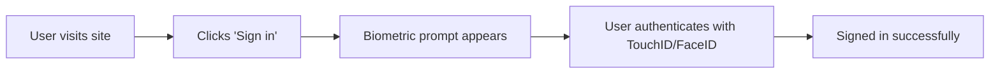

# Why Passkeys? 🔐

Passkeys represent the future of authentication - a passwordless, secure, and user-friendly way to sign in to applications. Let's explore why they're revolutionary and why you should implement them in your applications.

## The Password Problem

Traditional password-based authentication has fundamental issues:

### 🚨 **Security Vulnerabilities**
- **Data breaches** expose millions of passwords
- **Phishing attacks** trick users into revealing credentials
- **Weak passwords** are easily guessed or cracked
- **Password reuse** amplifies security risks across services

### 😤 **Poor User Experience**
- **Forgotten passwords** lead to frustrated users and support tickets
- **Complex requirements** make passwords hard to remember
- **Account lockouts** prevent users from accessing their accounts
- **Multi-step recovery** processes are time-consuming

### 💸 **Business Costs**
- **Support costs** for password resets (average $70 per reset)
- **Abandoned signups** due to password friction
- **Security breaches** can cost millions in damages
- **Compliance overhead** for password storage and management

## The Passkey Solution

Passkeys solve these problems with modern cryptography and device security:

### 🛡️ **Unbreachable Security**

**Public Key Cryptography**
- Private keys never leave the user's device
- No shared secrets that can be stolen
- Cryptographically impossible to guess or crack

**Phishing Resistance**
- Passkeys are bound to specific domains
- Cannot be tricked into working on fake sites
- Automatic protection against social engineering

**Device Security**
- Protected by biometric authentication (TouchID, FaceID, fingerprint)
- Hardware security modules (TPM, Secure Enclave)
- Multi-factor authentication built-in

### ⚡ **Superior User Experience**

**One-Touch Authentication**


**Cross-Device Sync**
- Passkeys sync across user's devices (iOS, macOS, Windows, Android)
- QR code authentication for new devices
- Seamless experience across all platforms

**No Setup Friction**
- Works immediately on supported devices
- No complex password requirements
- No need to remember anything

### 📈 **Business Benefits**

**Increased Conversion**
- 20-30% higher signup completion rates
- Reduced cart abandonment
- Faster user onboarding

**Reduced Costs**
- 90% reduction in password reset tickets
- Lower customer support overhead
- Decreased security incident costs

**Improved Security Posture**
- Eliminate password-related breaches
- Meet modern security standards
- Future-proof authentication

## Industry Adoption

Major technology companies are leading the passkey revolution:

### 🍎 **Apple**
- Passkeys built into iOS 16+, macOS 13+
- iCloud Keychain synchronization
- Safari browser support

### 🌐 **Google**
- Passkeys in Chrome and Android
- Google Account passkey support
- Chrome Password Manager integration

### 🪟 **Microsoft**
- Windows Hello integration
- Azure AD passkey support
- Edge browser implementation

### 🏢 **Enterprise Adoption**
Major companies implementing passkeys:
- **PayPal** - Reduced authentication time by 4x
- **Best Buy** - 20% increase in account creation
- **Kayak** - 50% faster signin process

## Technical Standards

Passkeys are built on established, secure standards:

### 🔒 **FIDO2/WebAuthn**
- W3C and FIDO Alliance standards
- Cross-platform compatibility
- Hardware security requirements

### 🔐 **Cryptographic Foundation**
- Elliptic Curve Cryptography (ECC)
- RSA with PKCS#1 padding
- Hardware-backed key generation

### 🌐 **Browser Support**
| Browser | Version | Support |
|---------|---------|---------|
| Chrome | 67+ | ✅ Full |
| Safari | 14+ | ✅ Full |
| Firefox | 60+ | ✅ Full |
| Edge | 79+ | ✅ Full |

## Implementation Considerations

### ✅ **When to Use Passkeys**

**Perfect For:**
- Consumer applications with frequent logins
- High-security applications (banking, healthcare)
- Modern web and mobile applications
- Progressive Web Apps (PWAs)

**Ideal Users:**
- Mobile-first applications
- Tech-savvy user bases
- Security-conscious organizations
- Global applications (regulatory compliance)

### ⚠️ **Fallback Strategies**

While passkeys are powerful, consider these fallback options:

**OAuth Integration**
- Google, GitHub, Microsoft social login
- Familiar authentication for users
- Wide compatibility across devices

**Magic Links**
- Email-based authentication
- Works on any device with email
- Good for older browsers

**Traditional Passwords**
- Legacy system compatibility
- Enterprise requirements
- Gradual migration path

## Getting Started with PasskeyMe

PasskeyMe makes implementing passkeys simple:

### 🚀 **Quick Integration**
```javascript
// Simple API call to create a passkey
const response = await fetch('https://api.passkeyme.com/v1/auth/passkey/register', {
  method: 'POST',
  headers: {
    'Authorization': 'Bearer YOUR_API_KEY',
    'Content-Type': 'application/json'
  },
  body: JSON.stringify({
    username: 'user@example.com',
    displayName: 'John Doe'
  })
});
```

### 🛡️ **Built-in Security**
- FIDO2/WebAuthn compliance
- Hardware security requirements
- Automatic security updates

### 📱 **Cross-Platform Support**
- Web, iOS, Android compatibility
- Seamless device synchronization
- QR code cross-device authentication

## Next Steps

Ready to implement passkeys in your application?

1. **[Get Started](./getting-started/quick-start)** - Set up your PasskeyMe account
2. **[Installation Guide](./getting-started/installation)** - Install and configure the SDK
3. **[API Reference](./api/authentication)** - Explore the complete API
4. **[Troubleshooting](./troubleshooting/common-issues)** - Common issues and solutions

---

**Next:** [Get started with PasskeyMe](./getting-started/quick-start) →
